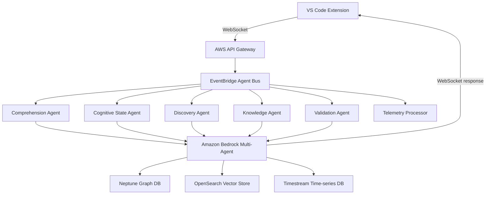
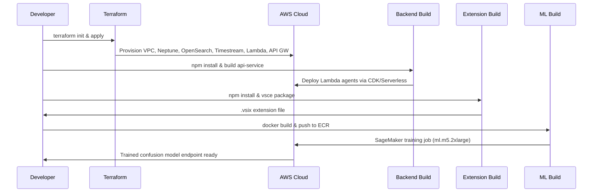

# Cognitive Compass — Master Architecture & Build Plan

# Cognitive Compass — Master Architecture & Build Plan

## Project Vision

Cognitive Compass is a **VS Code extension + AWS cloud system** that eliminates developer context switching by detecting confusion in real-time and proactively explaining code before the developer even asks for help.


| Metric                          | Target                               |
| ------------------------------- | ------------------------------------ |
| Comprehension speed improvement | 73% faster                           |
| Context switch reduction        | 89% fewer                            |
| Onboarding acceleration         | 6x faster                            |
| Explanation delivery latency    | < 2 seconds                          |
| Proactive help trigger window   | 30–60 seconds before confusion peaks |


---

## System Architecture

### High-Level Component Map



### Data Flow Pipelines


| Flow              | Route                                                             |
| ----------------- | ----------------------------------------------------------------- |
| **Telemetry**     | Extension → Kinesis → Lambda → Timestream + Real-time inference   |
| **Explanation**   | Confusion detected → Multi-Agent orchestration → Response in <2s  |
| **Knowledge**     | Explanation generated → Vector embedding → OpenSearch + S3 Tables |
| **Visualization** | Agent response → WebSocket → React Three Fiber → 3D render        |


---

## AI & ML Stack


| Component                | Technology                                     |
| ------------------------ | ---------------------------------------------- |
| Code Understanding       | Amazon Nova Pro (`amazon.nova-pro-v1:0`)       |
| Hallucination Prevention | Bedrock Automated Reasoning                    |
| Confusion Prediction     | Custom SageMaker LSTM + Random Forest ensemble |
| Embeddings               | Amazon Titan Embed Text v2 (1536 dimensions)   |
| Agent Orchestration      | Amazon Bedrock Multi-Agent Collaboration       |


The **5 AI Agents**:

1. **Comprehension Agent** — Generates natural-language code explanations
2. **Cognitive State Agent** — Detects and predicts confusion state from telemetry
3. **Discovery Agent** — Explores codebase to gather contextual knowledge
4. **Knowledge Agent** — Stores and retrieves past explanations via vector search
5. **Validation Agent** — Generates quizzes to confirm understanding

---

## Telemetry System

Telemetry is captured at **100ms intervals** and includes:

- Cursor position & movement speed/acceleration
- Scroll direction, delta, and oscillation patterns
- Keypress patterns (insert, delete, undo, redo)
- Selection hesitation duration
- Tab switches and file open/close events
- Hover exploration events

### Confusion Signal Detection


| Signal                 | Description                                    |
| ---------------------- | ---------------------------------------------- |
| `scroll_oscillation`   | Back-and-forth scrolling over same code region |
| `long_pause`           | >12s inactivity while file is open             |
| `rapid_tab_switch`     | Frequently switching between files             |
| `undo_spree`           | Multiple consecutive undo operations           |
| `hover_exploration`    | Hovering over many symbols without typing      |
| `selection_hesitation` | Long held selections without action            |
| `cursor_jerk`          | Erratic, non-linear cursor movement            |


The **ML feature vector** is 50-dimensional, computed across 4 time windows (5s, 30s, 120s, 300s) for multi-scale behavioral analysis.

---

## Data Architecture

### AWS Data Stores


| Store                 | Technology                                    | Purpose                                |
| --------------------- | --------------------------------------------- | -------------------------------------- |
| Time-series telemetry | Amazon Timestream (`cognitive-telemetry` DB)  | Raw interaction events                 |
| Vector embeddings     | Amazon OpenSearch Serverless (`cc-knowledge`) | Semantic explanation search            |
| Knowledge graph       | Amazon Neptune                                | Code relationship graph, concept links |


---

## VS Code Extension UI

The extension provides a **side panel WebView** with:

- Real-time cognitive state indicator
- **3D code visualization** powered by React Three Fiber + Three.js
  - Interactive data-flow graph (`CodeGraph.tsx`)
  - Step-through execution player (`ExecutionPlayer.tsx`)
- On-demand explanation pane
- Proactive help notifications

```wireframe
<!DOCTYPE html>
<html>
<head>
<style>
* { box-sizing: border-box; margin: 0; padding: 0; font-family: 'Segoe UI', sans-serif; font-size: 12px; }
body { background: #1e1e1e; color: #d4d4d4; height: 100vh; display: flex; flex-direction: column; }
.topbar { background: #252526; padding: 8px 12px; display: flex; align-items: center; justify-content: space-between; border-bottom: 1px solid #3c3c3c; }
.topbar .title { font-size: 11px; font-weight: 600; letter-spacing: 0.05em; text-transform: uppercase; color: #cccccc; }
.state-badge { padding: 2px 8px; border-radius: 10px; font-size: 10px; font-weight: 600; background: #2d7d46; color: #fff; }
.state-badge.confused { background: #c44b1e; }
.three-canvas { flex: 1; background: #141414; position: relative; display: flex; align-items: center; justify-content: center; border-bottom: 1px solid #3c3c3c; }
.canvas-label { color: #555; font-size: 11px; text-align: center; }
.canvas-nodes { position: absolute; top: 20px; left: 20px; display: flex; flex-direction: column; gap: 8px; }
.node { padding: 5px 10px; border-radius: 4px; background: #264f78; border: 1px solid #4fc1ff; font-size: 10px; }
.node.active { background: #3a2f00; border-color: #f9c74f; }
.edge { width: 1px; height: 24px; background: #555; margin-left: 30px; }
.explanation-panel { background: #252526; padding: 12px; max-height: 200px; overflow-y: auto; }
.explanation-panel .label { font-size: 10px; color: #888; text-transform: uppercase; letter-spacing: 0.05em; margin-bottom: 6px; }
.explanation-panel .text { font-size: 12px; line-height: 1.6; color: #d4d4d4; }
.proactive-banner { background: #1e3a5f; border-left: 3px solid #4fc1ff; padding: 8px 12px; display: flex; align-items: center; gap: 8px; }
.proactive-banner .icon { font-size: 14px; }
.proactive-banner .msg { font-size: 11px; color: #9cdcfe; }
.bottombar { background: #007acc; padding: 4px 12px; display: flex; gap: 16px; font-size: 10px; color: #fff; }
</style>
</head>
<body>
  <div class="topbar">
    <span class="title">🧠 Cognitive Compass</span>
    <span class="state-badge">Focused</span>
  </div>
  <div class="three-canvas">
    <div class="canvas-nodes">
      <div class="node active">fetchUserData()</div>
      <div class="edge"></div>
      <div class="node">parseResponse()</div>
      <div class="edge"></div>
      <div class="node">updateStore()</div>
    </div>
    <div class="canvas-label" style="position:absolute;bottom:12px;right:12px;font-size:10px;">3D Code Graph · React Three Fiber</div>
  </div>
  <div class="proactive-banner">
    <span class="icon">💡</span>
    <span class="msg">Detected confusion on <strong>useEffect</strong> — showing data flow explanation</span>
  </div>
  <div class="explanation-panel">
    <div class="label">AI Explanation</div>
    <div class="text">The <code>useEffect</code> hook runs after the component renders. Here, it fetches user data when <code>userId</code> changes. The cleanup function cancels the request if the component unmounts before the fetch completes...</div>
  </div>
  <div class="bottombar">
    <span>Signals: scroll_oscillation ↑</span>
    <span>|</span>
    <span>Confidence: 82%</span>
    <span>|</span>
    <span>WebSocket: Connected</span>
  </div>
</body>
</html>
```

---

## File Inventory (47 Files)

### Phase 1 — Shared Foundation (Files 1–5)


| #   | Path                                 | Purpose                            |
| --- | ------------------------------------ | ---------------------------------- |
| 1   | `/shared/types/index.ts`             | All TypeScript interfaces          |
| 2   | `/shared/constants/aws.ts`           | AWS service ARNs, regions          |
| 3   | `/shared/utils/telemetry-helpers.ts` | Telemetry processing utilities     |
| 4   | `/shared/utils/encryption.ts`        | Client-side AES-256-GCM encryption |
| 5   | `/package.json`                      | Root Turborepo workspace config    |


### Phase 2 — Infrastructure (Files 6–15)


| #   | Path                                         | Purpose                           |
| --- | -------------------------------------------- | --------------------------------- |
| 6   | `/infrastructure/terraform/providers.tf`     | AWS provider setup                |
| 7   | `/infrastructure/terraform/vpc.tf`           | Networking foundation             |
| 8   | `/infrastructure/terraform/bedrock.tf`       | AI/ML services                    |
| 9   | `/infrastructure/terraform/neptune.tf`       | Graph database                    |
| 10  | `/infrastructure/terraform/opensearch.tf`    | Search & vectors                  |
| 11  | `/infrastructure/terraform/timestream.tf`    | Time-series DB                    |
| 12  | `/infrastructure/terraform/lambda-agents.tf` | 5 Lambda functions                |
| 13  | `/infrastructure/terraform/api-gateway.tf`   | HTTP + WebSocket APIs             |
| 14  | `/infrastructure/terraform/iam.tf`           | Least-privilege security policies |
| 15  | `/infrastructure/terraform/outputs.tf`       | Export values for apps            |


### Phase 3 — VS Code Extension (Files 16–28)


| #   | Path                                                | Purpose                      |
| --- | --------------------------------------------------- | ---------------------------- |
| 16  | `/apps/vscode-extension/package.json`               | Extension manifest           |
| 17  | `/apps/vscode-extension/tsconfig.json`              | TypeScript strict config     |
| 18  | `/apps/vscode-extension/src/extension.ts`           | Activation entry point       |
| 19  | `src/services/TelemetryService.ts`                  | 100ms event capture          |
| 20  | `src/services/CognitiveStateDetector.ts`            | Local confusion ML inference |
| 21  | `src/services/WebSocketManager.ts`                  | Real-time comms              |
| 22  | `src/services/AgentOrchestrator.ts`                 | Backend agent coordination   |
| 23  | `src/commands/CommandHandlers.ts`                   | VS Code commands             |
| 24  | `src/providers/WebviewProvider.ts`                  | Side panel UI host           |
| 25  | `src/webviews/3d-visualization/index.tsx`           | React entry point            |
| 26  | `src/webviews/3d-visualization/CodeGraph.tsx`       | Three.js 3D graph            |
| 27  | `src/webviews/3d-visualization/ExecutionPlayer.tsx` | Step-through debugger        |
| 28  | `/apps/vscode-extension/webpack.config.js`          | Build configuration          |


### Phase 4 — Backend Agents (Files 29–39)


| #   | Path                                        | Purpose                       |
| --- | ------------------------------------------- | ----------------------------- |
| 29  | `/apps/api-service/package.json`            | Backend dependencies          |
| 30  | `agents/comprehension-agent/index.ts`       | Code explanation via Nova Pro |
| 31  | `agents/cognitive-state-agent/index.ts`     | Confusion detection           |
| 32  | `agents/discovery-agent/index.ts`           | Codebase exploration          |
| 33  | `agents/knowledge-agent/index.ts`           | OpenSearch storage/retrieval  |
| 34  | `agents/validation-agent/index.ts`          | Quiz generation               |
| 35  | `agents/telemetry-processor/index.ts`       | Kinesis stream consumer       |
| 36  | `orchestration/multi-agent-collaborator.ts` | Bedrock agent coordination    |
| 37  | `handlers/websocket-handler.ts`             | API Gateway WebSocket         |
| 38  | `handlers/http-handler.ts`                  | REST API                      |
| 39  | `utils/bedrock-client.ts`                   | AWS SDK wrapper with retry    |


### Phase 5 — ML Service (Files 40–44)


| #   | Path                                                | Purpose                           |
| --- | --------------------------------------------------- | --------------------------------- |
| 40  | `/apps/ml-service/training/feature-engineering.py`  | Telemetry → 50-dim feature vector |
| 41  | `/apps/ml-service/training/confusion-model.py`      | LSTM + RF ensemble training       |
| 42  | `/apps/ml-service/inference/real-time-predictor.ts` | SageMaker endpoint client         |
| 43  | `/apps/ml-service/requirements.txt`                 | Python dependencies               |
| 44  | `/apps/ml-service/Dockerfile`                       | SageMaker training container      |


### Phase 6 — DevOps & Docs (Files 45–47)


| #   | Path                            | Purpose                   |
| --- | ------------------------------- | ------------------------- |
| 45  | `/.github/workflows/deploy.yml` | CI/CD pipeline            |
| 46  | `/README.md`                    | Project documentation     |
| 47  | `/.cursorrules`                 | AI coding assistant rules |


---

## Code Quality Rules (Non-Negotiable)


| Rule                          | Enforcement                                         |
| ----------------------------- | --------------------------------------------------- |
| No `any` type                 | Use `unknown` with type guards or proper interfaces |
| No `console.log`              | Use structured logger (Winston/Pino)                |
| No empty catch blocks         | Always handle, log, and re-throw                    |
| No magic numbers              | Named constants only                                |
| Functions ≤ 50 lines          | Split into pure, composable functions               |
| All async must have try/catch | Wrap in `Result<T, E>` pattern                      |
| All external calls must retry | Exponential backoff, minimum 3 attempts             |
| All user input must validate  | Zod schemas, fail fast                              |
| No secrets in code            | Environment variables only                          |
| No blocking I/O               | Everything async                                    |


---

## Security Architecture

- **Client-side encryption**: AES-256-GCM with scrypt key derivation before any telemetry leaves the IDE
- **Code content never transmitted raw** — only hashed identifiers for deduplication
- **Least-privilege IAM** — per-function execution roles with resource-scoped policies
- **Cognito** for developer authentication (`userId` = Cognito sub)
- **All inputs validated** via Zod before processing

---

## Build & Deployment Sequence



---

## Success Criteria

A developer installs the extension, opens any code file, gets confused, and receives **proactive help with 3D visualization within 3 seconds**.