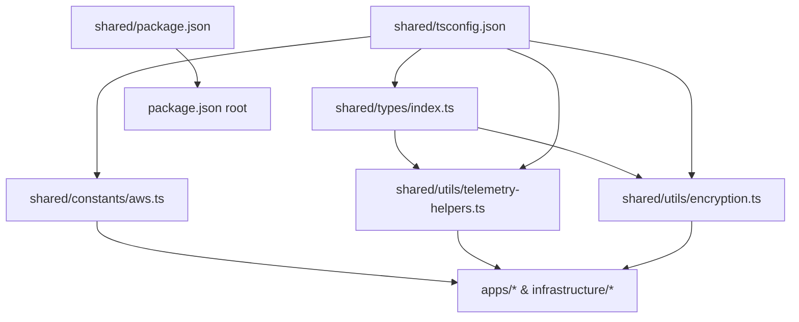

I have created the following plan after thorough exploration and analysis of the codebase. Follow the below plan verbatim. Trust the files and references. Do not re-verify what's written in the plan. Explore only when absolutely necessary. First implement all the proposed file changes and then I'll review all the changes together at the end.

## Observations

The workspace is currently empty except for `plan.md`. The spec and ticket define all 7 files for Phase 1 with precise field-level detail. Several `any` usages exist in the spec's raw pseudocode (`ConfusionSignal.metadata`, `CodeStep.variables`, `AgentMessage.payload`, `WebSocketMessage.payload`) that must be replaced with `unknown` per the code quality rules. The `detectLongPause` function calls `Date.now()` (a side effect) — this must be addressed by accepting a `now` parameter to keep the function pure. The `hashCode` browser path uses `require('crypto')` which must be corrected to a static import pattern.

## Approach

Create the 7 files bottom-up in dependency order: types first (no dependencies), then constants (no imports from shared), then utilities (import from types), then package configs last. Each file strictly follows the spec with `any` replaced by `unknown`, named constants replacing magic numbers, and pure functions enforced throughout.

---

## Implementation Steps

### Step 1 — Create `file:shared/types/index.ts`

Create the file at `shared/types/index.ts`. Define and export all interfaces in this order:

**Payload sub-types** (not exported individually, but exported to allow external narrowing):
- `CursorPayload` — `x`, `y`, `line`, `character` (numbers), `speed?`, `acceleration?` (numbers)
- `ScrollPayload` — `direction: 'up' | 'down'`, `delta`, `startLine`, `endLine`, `totalLines`
- `KeypressPayload` — `key?: string`, `isInsert`, `isDelete`, `isUndo`, `isRedo` (booleans), `changeSize: number`
- `SelectionPayload` — `startLine`, `startChar`, `endLine`, `endChar` (numbers), `isEmpty: boolean`, `duration?: number`
- `TabSwitchPayload` — `from?: string`, `to?: string`, `isNewTab: boolean`
- `FilePayload` — `path`, `languageId` (strings), `lineCount: number`, `action: 'open' | 'close'`
- `HoverPayload` — `symbol: string`, `line: number`, `character: number`
- `CommandPayload` — `commandId: string`

**Primary exported interfaces:**
- `TelemetryEvent` — `timestamp: number`, `userId: string`, `sessionId: string`, `projectId: string`, `eventType` union literal, `payload` as the union of all 8 payload types, `filePath?: string`, `lineNumber?: number`, `columnNumber?: number`
- `CognitiveState` — `state` union, `confidence: number`, `detectedSignals: ConfusionSignal[]`, `predictedTimeToHelp: number`, `recommendedAction` union, `learningStyle` union
- `ConfusionSignal` — `type` union of 7 signal names, `confidence: number`, `timestamp: number`, `metadata: Record<string, unknown>` (**not** `any`)
- `ExplanationRequest` — fields per spec; `confusionSignals: ConfusionSignal[]`, `projectContext?: string`
- `ExplanationResponse` — `id`, `timestamp`, `explanation`, `keyConcepts: string[]`, `dataFlow: DataFlowGraph`, `codeWalkthrough: CodeStep[]`, `confidence: number`, `reasoningTrace: string`, `suggestedQuestions: string[]`, `estimatedReadTime: number`
- `DataFlowGraph` — `nodes: DataNode[]`, `edges: DataEdge[]`
- `DataNode` — `id`, `label`, `type` union (6 values), `description?`, `codeSnippet?`, `lineRange?: [number, number]`
- `DataEdge` — `from`, `to`, `label`, `type` union (4 values)
- `CodeStep` — `stepNumber: number`, `lineNumber: number`, `description: string`, `variables: Record<string, unknown>` (**not** `any`), `stdout?: string`
- `AgentMessage` — `from`, `to`, `messageType` union, `payload: unknown` (**not** `any`), `timestamp: number`, `conversationId: string`, `correlationId: string`
- `DeveloperSession` — per spec
- `UserProfile` — per spec
- `WebSocketMessage` — `type` union (5 values), `payload: unknown` (**not** `any`), `timestamp: number`

**Utility types** at the bottom:
- `Nullable<T>`, `Optional<T>`, `Result<T, E = Error>`

Export all payload types alongside the main interfaces so downstream consumers can perform type narrowing without casting.

---

### Step 2 — Create `file:shared/constants/aws.ts`

Create `shared/constants/aws.ts`. Define named constants at the top of the file before `AWS_CONFIG` to avoid magic numbers:

```
NOVA_PRO_MODEL_ID, CLAUDE_SONNET_MODEL_ID, TITAN_EMBED_MODEL_ID
NEPTUNE_PORT, NEPTUNE_ENGINE_VERSION
VECTOR_DIMENSIONS (1536)
LAMBDA_MEMORY_MB (1024), LAMBDA_TIMEOUT_SECONDS (30), LAMBDA_CONCURRENT_EXECUTIONS (100)
```

Then declare `AWS_CONFIG as const` using these named constants:
- `REGION: 'us-east-1'`
- `ACCOUNT_ID: process.env['AWS_ACCOUNT_ID'] ?? ''` — no `!` non-null assertion (validation done in `validateAwsConfig`)
- `BEDROCK.MODELS` — the 3 model IDs using named constants
- `BEDROCK.FEATURES` — `MULTI_AGENT_COLLABORATION: true`, `AUTOMATED_REASONING: true`
- `NEPTUNE` — `CLUSTER_IDENTIFIER: 'cc-neptune-cluster'`, `INSTANCE_CLASS: 'db.t3.medium'`, `ENGINE_VERSION`, `PORT: 8182` via named constant
- `OPENSEARCH` — `COLLECTION_NAME: 'cc-knowledge'`, `VECTOR_DIMENSIONS`, `ENGINE: 'OPENSEARCH_2_11'`
- `TIMESTREAM` — `DATABASE_NAME: 'cognitive-telemetry'`, `TABLE_NAME: 'interaction-events'`
- `LAMBDA` — `RUNTIME: 'nodejs20.x'`, `MEMORY_SIZE`, `TIMEOUT`, `CONCURRENT_EXECUTIONS` via named constants
- `API_GATEWAY` — `WEBSOCKET_ROUTE: '$default'`, `HTTP_API_VERSION: '2.0'`

Export `validateAwsConfig(): void` that checks `['AWS_REGION', 'AWS_ACCOUNT_ID', 'BEDROCK_MODEL_ACCESS']` against `process.env`, collects missing names, and throws a descriptive `Error` if any are absent.

---

### Step 3 — Create `file:shared/utils/telemetry-helpers.ts`

Create `shared/utils/telemetry-helpers.ts`. Import `TelemetryEvent` from `'../types'` (no `ConfusionSignal` needed directly).

Define named constants at the top:
```
SCROLL_OSCILLATION_NORMALIZATION = 5
LONG_PAUSE_CAP_MS = 30000
CHARS_PER_WORD = 5
MIN_SCROLL_EVENTS = 3
```

Implement the 4 exported pure functions:

**`calculateScrollOscillation(events: TelemetryEvent[]): number`**
- Filter to `scroll` events; return `0` if fewer than `MIN_SCROLL_EVENTS`
- Count direction changes by comparing consecutive `ScrollPayload.direction` values; use a type-narrowing helper to safely extract the payload
- Return `Math.min(1, directionChanges / SCROLL_OSCILLATION_NORMALIZATION)`
- Use `instanceof` or a type guard function (e.g., `isScrollPayload`) instead of casting to avoid `any`/unsafe casts

**`detectLongPause(events: TelemetryEvent[], thresholdMs = 12000, now = Date.now()): number`**
- Accept `now` as a third parameter with default `Date.now()` — this makes the function **pure and testable** (no hidden side effects)
- If `events` is empty, return `0`
- Compute `pauseDuration = now - events[events.length - 1].timestamp`
- Return `Math.min(1, pauseDuration / LONG_PAUSE_CAP_MS)` if `pauseDuration > thresholdMs`, else `0`

**`calculateTypingSpeed(events: TelemetryEvent[], windowMs = 60000, now = Date.now()): number`**
- Same `now` parameter pattern for purity
- Filter to `keypress` events within the window where `KeypressPayload.isInsert === true`; use a type guard for the payload
- Sum `changeSize` values; return `(chars / CHARS_PER_WORD) / (windowMs / 60000)`

**`extractFeatures(events: TelemetryEvent[], now = Date.now()): number[]`**
- Accept `now` parameter for purity
- Initialize `features` as `new Array(50).fill(0)` — typed as `number[]`
- Define `WINDOWS = [5000, 30000, 120000, 300000]` and `FEATURES_PER_WINDOW = 12` as named constants
- For each of the 4 windows, slice events within the window and fill 12 features starting at `windowIdx * FEATURES_PER_WINDOW`:
  - Indices 0–3: event-type counts (cursor, scroll, keypress, tab_switch)
  - Index 4: `calculateScrollOscillation(windowEvents)`
  - Index 5: undo count (using type guard)
  - Index 6: delete count (using type guard)
  - Indices 7–8: mean and stdDev of inter-event intervals (only if `windowEvents.length > 1`)
  - Indices 9–11: reserved/zero (fill to reach 12 per window, keeping the total at 4×12=48)
- Index 48: `features[0] - features[12]` (cursor activity trend)
- Index 49: `features[4] > 0.5 ? 1 : 0` (high oscillation flag)
- Return `features`

**Private pure math helpers** (unexported):
- `average(arr: number[]): number`
- `stdDev(arr: number[]): number`

**Type guard helpers** (unexported):
- `isScrollPayload(p: unknown): p is ScrollPayload`
- `isKeypressPayload(p: unknown): p is KeypressPayload`

---

### Step 4 — Create `file:shared/utils/encryption.ts`

Create `shared/utils/encryption.ts`. Use only the Node.js `crypto` module via named static imports: `import { createCipheriv, createDecipheriv, randomBytes, scryptSync, createHash } from 'crypto'`.

Define named constants (no magic numbers):
```
ALGORITHM = 'aes-256-gcm'
KEY_LENGTH = 32
IV_LENGTH = 16
AUTH_TAG_LENGTH = 16
SALT_LENGTH = 32
SCRYPT_N = 32768
SCRYPT_R = 8
SCRYPT_P = 1
```

**`deriveKey(password: string, salt: Buffer): Buffer`** (unexported)  
- Call `scryptSync(password, salt, KEY_LENGTH, { N: SCRYPT_N, r: SCRYPT_R, p: SCRYPT_P })`
- Return the result typed as `Buffer`

**`encrypt(plaintext: string, password: string): string`** (exported)  
- Generate `salt = randomBytes(SALT_LENGTH)` and `iv = randomBytes(IV_LENGTH)`
- Derive key, create cipher, update + final, retrieve auth tag
- Concatenate `[salt, iv, authTag, encrypted]` into a single `Buffer` and return as base64

**`decrypt(ciphertext: string, password: string): string`** (exported)  
- Decode base64 into `Buffer`
- Slice out salt, iv, authTag, encrypted using named constants as offsets
- Derive key, create decipher, set auth tag, update + final
- Return `utf8` string

**`hashCode(content: string): string`** (exported)  
- Since the spec requires Node `crypto` only and the ticket says "SHA-256 in Node or fallback in browser":
  - Wrap in a `try/catch`: attempt `createHash('sha256').update(content).digest('hex')` and take the first 32 hex chars
  - In the catch (non-Node environment), implement the djb2-style integer hash fallback as specified, returning `Math.abs(hash).toString(16)`
  - **No `require()`** — `createHash` is already imported statically at the top; the browser fallback is the catch path

No `any` types anywhere — all Buffer operations are typed.

---

### Step 5 — Create `file:shared/tsconfig.json`

Create `shared/tsconfig.json` as a strict TypeScript configuration:

```json
{
  "compilerOptions": {
    "target": "ES2020",
    "module": "CommonJS",
    "lib": ["ES2020"],
    "declaration": true,
    "declarationMap": true,
    "sourceMap": true,
    "outDir": "./dist",
    "rootDir": "./src",
    "strict": true,
    "noImplicitAny": true,
    "strictNullChecks": true,
    "strictFunctionTypes": true,
    "noUnusedLocals": true,
    "noUnusedParameters": true,
    "noImplicitReturns": true,
    "esModuleInterop": true,
    "skipLibCheck": true,
    "forceConsistentCasingInFileNames": true
  },
  "include": ["types/**/*", "constants/**/*", "utils/**/*"],
  "exclude": ["node_modules", "dist"]
}
```

---

### Step 6 — Create `file:shared/package.json`

Create `shared/package.json`:

```json
{
  "name": "@cognitive-compass/shared",
  "version": "0.1.0",
  "private": true,
  "main": "./dist/types/index.js",
  "types": "./dist/types/index.d.ts",
  "exports": {
    "./types": "./dist/types/index.js",
    "./constants/aws": "./dist/constants/aws.js",
    "./utils/telemetry-helpers": "./dist/utils/telemetry-helpers.js",
    "./utils/encryption": "./dist/utils/encryption.js"
  },
  "scripts": {
    "build": "tsc --project tsconfig.json",
    "lint": "eslint . --ext .ts",
    "typecheck": "tsc --noEmit"
  },
  "devDependencies": {
    "typescript": "^5.3.3",
    "@types/node": "^20.10.0"
  },
  "engines": {
    "node": ">=20.0.0"
  }
}
```

---

### Step 7 — Create `file:package.json` (Root)

Create the root `package.json` exactly per the spec:

- `name: "cognitive-compass"`, `version: "0.1.0"`, `private: true`
- `workspaces: ["apps/*", "shared/*"]`
- `scripts`: `build`, `dev`, `test`, `lint`, `deploy` (all via `turbo run <script>`), `infra:plan`, `infra:apply`, `extension:package`, `extension:publish`
- `devDependencies`: `turbo ^1.12.0`, `typescript ^5.3.3`, `@types/node ^20.10.0`, `eslint ^8.56.0`, `prettier ^3.2.0`, `husky ^8.0.3`, `lint-staged ^15.2.0`
- `engines`: `node >=20.0.0`, `npm >=10.0.0`
- `packageManager: "npm@10.2.0"`

---

## File Dependency Graph



## Key Quality Deviations From Raw Spec (Intentional Fixes)

| Issue in Raw Spec | Correct Approach |
|---|---|
| `metadata: Record<string, any>` in `ConfusionSignal` | `Record<string, unknown>` |
| `variables: Record<string, any>` in `CodeStep` | `Record<string, unknown>` |
| `payload: any` in `AgentMessage` and `WebSocketMessage` | `payload: unknown` |
| `detectLongPause` calls `Date.now()` internally | Accept `now = Date.now()` parameter for purity |
| `calculateTypingSpeed` calls `Date.now()` internally | Accept `now = Date.now()` parameter for purity |
| `extractFeatures` calls `Date.now()` internally | Accept `now = Date.now()` parameter for purity |
| `require('crypto')` inside `hashCode` | Static import at top; try/catch for browser fallback |
| Missing indices 9–11 per window in `extractFeatures` | Explicitly fill to 12 features per window (indices 9–11 = 0) to guarantee the 48+2=50 total |