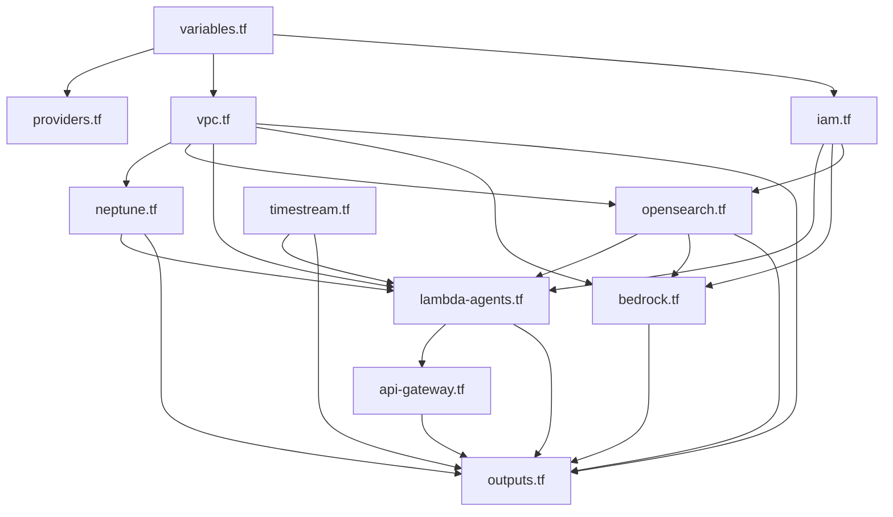

I have created the following plan after thorough exploration and analysis of the codebase. Follow the below plan verbatim. Trust the files and references. Do not re-verify what's written in the plan. Explore only when absolutely necessary. First implement all the proposed file changes and then I'll review all the changes together at the end.

## Observations

The workspace has Phase 1 complete. Key constants to keep consistent across Terraform files: Neptune cluster ID `cc-neptune-cluster`, engine version `1.3.0.0` (ticket takes precedence over `shared/constants/aws.ts` which has `1.2.0.0`), OpenSearch collection `cc-knowledge`, Timestream DB `cognitive-telemetry`/table `interaction-events`, Bedrock models `amazon.nova-pro-v1:0` and `amazon.titan-embed-text-v2:0`. No existing Terraform directory exists yet.

## Approach

Create `infrastructure/terraform/` as a flat directory of 11 HCL files (10 specified + `variables.tf`). All cross-file references use Terraform resource/output interpolation — no hardcoded ARNs. IAM is authored first conceptually since every other file depends on it, but in HCL all files coexist and Terraform resolves references at plan time.

---

## Implementation Instructions

### File dependency graph

---

### Step 1 — `infrastructure/terraform/variables.tf`

Define 4 input variables:

| Variable | Type | Default | Sensitive |
|---|---|---|---|
| `aws_region` | `string` | `"us-east-1"` | no |
| `aws_account_id` | `string` | none (required) | yes |
| `environment` | `string` | `"dev"` | no |
| `project_name` | `string` | `"cognitive-compass"` | no |

Add a `validation` block on `aws_account_id` enforcing a 12-digit numeric string regex (`^[0-9]{12}I have created the following plan after thorough exploration and analysis of the codebase. Follow the below plan verbatim. Trust the files and references. Do not re-verify what's written in the plan. Explore only when absolutely necessary. First implement all the proposed file changes and then I'll review all the changes together at the end.

) so that `terraform validate` catches missing or malformed values early.

---

### Step 2 — `infrastructure/terraform/providers.tf`

- `terraform` block: `required_version = ">= 1.6.0"`, `required_providers` with `hashicorp/aws ~> 5.0` and `hashicorp/random ~> 3.5`.
- `backend "s3"` block with placeholder keys (`bucket`, `key`, `region`) — these must be left as literal strings with comment markers (e.g. `# PLACEHOLDER`) because S3 backend blocks cannot use variable interpolation; document this with inline comments.
- `provider "aws"`: `region = var.aws_region`. Add a `default_tags` block with tags `project = var.project_name` and `environment = var.environment` to avoid repeating tags across resources.

---

### Step 3 — `infrastructure/terraform/vpc.tf`

**VPC:**
- `aws_vpc` `cc_vpc`: `cidr_block = "10.0.0.0/16"`, `enable_dns_support = true`, `enable_dns_hostnames = true`, `tags = { Name = "cc-vpc" }`.

**Data source for AZs:**
- `data "aws_availability_zones" "available"` with `state = "available"` — use `data.aws_availability_zones.available.names[0]` and `[1]` for subnet AZ placement.

**Subnets (4 total):**
- `aws_subnet` `cc_private_1`: `cidr_block = "10.0.1.0/24"`, `availability_zone = data.aws_availability_zones.available.names[0]`, `map_public_ip_on_launch = false`.
- `aws_subnet` `cc_private_2`: `cidr_block = "10.0.2.0/24"`, `availability_zone = data.aws_availability_zones.available.names[1]`.
- `aws_subnet` `cc_public_1`: `cidr_block = "10.0.101.0/24"`, `availability_zone = data.aws_availability_zones.available.names[0]`, `map_public_ip_on_launch = true`.
- `aws_subnet` `cc_public_2`: `cidr_block = "10.0.102.0/24"`, `availability_zone = data.aws_availability_zones.available.names[1]`, `map_public_ip_on_launch = true`.

**Internet Gateway:**
- `aws_internet_gateway` `cc_igw` attached to `aws_vpc.cc_vpc.id`, `tags = { Name = "cc-igw" }`.

**NAT Gateway:**
- `aws_eip` `cc_nat_eip`: `domain = "vpc"`, `tags = { Name = "cc-nat-eip" }`.
- `aws_nat_gateway` `cc_nat_gw`: `allocation_id = aws_eip.cc_nat_eip.id`, `subnet_id = aws_subnet.cc_public_1.id`, `depends_on = [aws_internet_gateway.cc_igw]`, `tags = { Name = "cc-nat-gw" }`.

**Route Tables:**
- `aws_route_table` `cc_public_rt`: one `route` block with `cidr_block = "0.0.0.0/0"`, `gateway_id = aws_internet_gateway.cc_igw.id`.
- `aws_route_table_association` for each public subnet (`cc_public_1`, `cc_public_2`).
- `aws_route_table` `cc_private_rt`: one `route` block with `cidr_block = "0.0.0.0/0"`, `nat_gateway_id = aws_nat_gateway.cc_nat_gw.id`.
- `aws_route_table_association` for each private subnet (`cc_private_1`, `cc_private_2`).

**Security Groups (3):**

- `aws_security_group` `cc_lambda_sg`:
  - `name = "cc-lambda-sg"`, `vpc_id = aws_vpc.cc_vpc.id`
  - `egress`: all traffic (`0.0.0.0/0`), all protocols
  - No ingress rules (no internet ingress needed for Lambda)

- `aws_security_group` `cc_neptune_sg`:
  - `name = "cc-neptune-sg"`, `vpc_id = aws_vpc.cc_vpc.id`
  - `ingress`: `from_port = 8182`, `to_port = 8182`, `protocol = "tcp"`, `security_groups = [aws_security_group.cc_lambda_sg.id]`
  - `egress`: none (or restrict to VPC CIDR only)

- `aws_security_group` `cc_opensearch_sg`:
  - `name = "cc-opensearch-sg"`, `vpc_id = aws_vpc.cc_vpc.id`
  - `ingress`: `from_port = 443`, `to_port = 443`, `protocol = "tcp"`, `security_groups = [aws_security_group.cc_lambda_sg.id]`
  - `egress`: none (or restrict to VPC CIDR only)

---

### Step 4 — `infrastructure/terraform/iam.tf`

This is the longest file. Author it early since `lambda-agents.tf` and `bedrock.tf` both reference its outputs.

**Local values:** Define locals for the Nova Pro model ARN (`arn:aws:bedrock:${var.aws_region}::foundation-model/amazon.nova-pro-v1:0`) and Titan Embed ARN (`arn:aws:bedrock:${var.aws_region}::foundation-model/amazon.titan-embed-text-v2:0`) — these avoid duplication across inline policies. **Do not hardcode account ID in these ARNs** (foundation model ARNs use `::` with no account segment).

**Trust policy data sources:**
- `data "aws_iam_policy_document" "lambda_trust_policy"`: principal `lambda.amazonaws.com`, action `sts:AssumeRole`.
- `data "aws_iam_policy_document" "bedrock_trust_policy"`: principal `bedrock.amazonaws.com`, action `sts:AssumeRole`.

**Managed policy attachment reference:** Use `aws_iam_role_policy_attachment` to attach `arn:aws:iam::aws:policy/service-role/AWSLambdaVPCAccessExecutionRole` to each of the 6 Lambda roles. This is a managed policy (AWS-owned), so the wildcard in its ARN is acceptable.

**Per-Lambda roles and inline policies:**

| Role resource name | `name` tag | Inline policy actions | Scoped resource |
|---|---|---|---|
| `cc_comprehension_role` | `cc-comprehension-agent-role` | `bedrock:InvokeModel` | Nova Pro model ARN |
| `cc_cognitive_state_role` | `cc-cognitive-state-agent-role` | `bedrock:InvokeModel`, `timestream:WriteRecords`, `timestream:DescribeTable` | Nova Pro ARN; `aws_timestreamwrite_table.cc_interaction_events.arn` |
| `cc_discovery_role` | `cc-discovery-agent-role` | `neptune-db:ReadDataViaQuery`, `neptune-db:WriteDataViaQuery` | `arn:aws:neptune-db:${var.aws_region}:${var.aws_account_id}:${aws_neptune_cluster.cc_neptune_cluster.cluster_resource_id}/*` |
| `cc_knowledge_role` | `cc-knowledge-agent-role` | `aoss:APIAccessAll`, `bedrock:InvokeModel` | `aws_opensearchserverless_collection.cc_knowledge.arn`, Titan Embed ARN |
| `cc_validation_role` | `cc-validation-agent-role` | `bedrock:InvokeModel` | Nova Pro model ARN |
| `cc_telemetry_processor_role` | `cc-telemetry-processor-role` | `kinesis:GetRecords`, `kinesis:GetShardIterator`, `kinesis:ListShards`, `kinesis:DescribeStream`, `timestream:WriteRecords` | `aws_kinesis_stream.cc_telemetry_stream.arn`; Timestream table ARN |

For the discovery role, note that Neptune IAM auth uses the `neptune-db:` action prefix and the resource is the cluster resource ID path, not the cluster ARN — reference `aws_neptune_cluster.cc_neptune_cluster.cluster_resource_id` once `neptune.tf` defines that resource.

**Bedrock agent role:**
- `aws_iam_role` `cc_bedrock_agent_role`: `name = "cc-bedrock-agent-role"`, trust policy = `bedrock.amazonaws.com`.
- Inline policy: `bedrock:InvokeAgent` and `bedrock:InvokeModel` on Nova Pro and Titan Embed ARNs, plus `aoss:APIAccessAll` on `aws_opensearchserverless_collection.cc_knowledge.arn`.

**Outputs (export all 7 role ARNs):**
- `comprehension_agent_role_arn`, `cognitive_state_agent_role_arn`, `discovery_agent_role_arn`, `knowledge_agent_role_arn`, `validation_agent_role_arn`, `telemetry_processor_role_arn`, `bedrock_agent_role_arn`.

---

### Step 5 — `infrastructure/terraform/neptune.tf`

- `aws_neptune_subnet_group` `cc_neptune_subnet_group`: `subnet_ids = [aws_subnet.cc_private_1.id, aws_subnet.cc_private_2.id]`, `name = "cc-neptune-subnet-group"`.
- `aws_neptune_cluster_parameter_group` `cc_neptune_params`: `family = "neptune1.3"`, `name = "cc-neptune-params"`.
- `aws_neptune_cluster` `cc_neptune_cluster`:
  - `cluster_identifier = "cc-neptune-cluster"`
  - `engine = "neptune"`, `engine_version = "1.3.0.0"`
  - `vpc_security_group_ids = [aws_security_group.cc_neptune_sg.id]`
  - `db_subnet_group_name = aws_neptune_subnet_group.cc_neptune_subnet_group.name`
  - `neptune_cluster_parameter_group_name = aws_neptune_cluster_parameter_group.cc_neptune_params.name`
  - `skip_final_snapshot = true`
  - `iam_database_authentication_enabled = true`
  - `deletion_protection = false`
  - `apply_immediately = true`
- `aws_neptune_cluster_instance` `cc_neptune_instance`:
  - `count = 1`, `cluster_identifier = aws_neptune_cluster.cc_neptune_cluster.id`
  - `instance_class = "db.t3.medium"`, `engine = "neptune"`, `apply_immediately = true`
  - `identifier = "cc-neptune-instance-${count.index}"`
- Outputs: `neptune_cluster_endpoint`, `neptune_reader_endpoint`, `neptune_port` (from `aws_neptune_cluster.cc_neptune_cluster` attributes: `.endpoint`, `.reader_endpoint`, `.port`).

---

### Step 6 — `infrastructure/terraform/opensearch.tf`

- `aws_opensearchserverless_collection` `cc_knowledge`:
  - `name = "cc-knowledge"`, `type = "VECTORSEARCH"`
  - `description = "Cognitive Compass knowledge vector store"`
  - `depends_on` on the three policy resources below (encryption policy is required before collection creation).

- `aws_opensearchserverless_security_policy` `cc_knowledge_encryption`:
  - `name = "cc-knowledge-enc"`, `type = "encryption"`
  - Policy JSON: `Rules = [{ResourceType: "collection", Resource: ["collection/cc-knowledge"]}]`, `AWSOwnedKey = true`.

- `aws_opensearchserverless_security_policy` `cc_knowledge_network`:
  - `name = "cc-knowledge-net"`, `type = "network"`
  - Policy JSON: `Rules = [{ResourceType: "collection", Resource: ["collection/cc-knowledge"]}, {ResourceType: "dashboard", Resource: ["collection/cc-knowledge"]}]`, `SourceVPCEs` or use `AllowFromPublic = false` with VPC endpoint — since OpenSearch Serverless uses VPC endpoint resources (`aws_opensearchserverless_vpc_endpoint`), add an `aws_opensearchserverless_vpc_endpoint` `cc_opensearch_vpc_endpoint` in the first private subnet with `cc_opensearch_sg` security group, then reference its ID in the network policy `SourceVPCEs`.

- `aws_opensearchserverless_access_policy` `cc_knowledge_access`:
  - `name = "cc-knowledge-access"`, `type = "data"`
  - Policy JSON grants the Bedrock agent role ARN (`aws_iam_role.cc_bedrock_agent_role.arn`) `aoss:CreateCollectionItems`, `aoss:DeleteCollectionItems`, `aoss:UpdateCollectionItems`, `aoss:DescribeCollectionItems` on `index/cc-knowledge/*` and `aoss:CreateIndex`, `aoss:DeleteIndex`, `aoss:UpdateIndex`, `aoss:DescribeIndex`, `aoss:ReadDocument`, `aoss:WriteDocument` on the index resource.

- Outputs: `opensearch_collection_endpoint` (from `aws_opensearchserverless_collection.cc_knowledge.collection_endpoint`), `opensearch_collection_arn` (from `.arn`).

---

### Step 7 — `infrastructure/terraform/timestream.tf`

- `aws_timestreamwrite_database` `cc_telemetry_db`: `database_name = "cognitive-telemetry"`.
- `aws_timestreamwrite_table` `cc_interaction_events`:
  - `database_name = aws_timestreamwrite_database.cc_telemetry_db.database_name`
  - `table_name = "interaction-events"`
  - `retention_properties` block: `memory_store_retention_period_in_hours = 24`, `magnetic_store_retention_period_in_days = 365`.
- Outputs: `timestream_database_arn`, `timestream_table_arn`.

---

### Step 8 — `infrastructure/terraform/lambda-agents.tf`

**Placeholder archive per Lambda:**  
Use `data "archive_file"` (provider `hashicorp/archive`, which is implicitly available with the AWS provider — but check first). Actually, `archive_file` requires adding `hashicorp/archive` to `required_providers`. Add `hashicorp/archive ~> 2.4` to `providers.tf`. Then define one `data "archive_file"` per Lambda (or share one) with `type = "zip"`, `output_path = "${path.module}/placeholder-<name>.zip"`, and a single `content` source block for an empty `index.js` string (content `"exports.handler = async () => ({ statusCode: 200 });"`, filename `"index.js"`).

**Kinesis stream (prerequisite for telemetry-processor event source mapping):**
- `aws_kinesis_stream` `cc_telemetry_stream`: `name = "cc-telemetry-stream"`, `shard_count = 1`, `tags = { Name = "cc-telemetry-stream" }`.

**6 Lambda function resources:**

For each of `comprehension`, `cognitive-state`, `discovery`, `knowledge`, `validation`, `telemetry-processor`:

- `aws_lambda_function` resource name: `cc_<snake>_agent` (e.g., `cc_comprehension_agent`)
- `function_name = "cc-<kebab>-agent"` (e.g., `cc-comprehension-agent`)
- `runtime = "nodejs20.x"`, `handler = "index.handler"`
- `memory_size = 1024`, `timeout = 30`, `reserved_concurrent_executions = 100`
- `role` = corresponding role ARN from `iam.tf` (e.g., `aws_iam_role.cc_comprehension_role.arn`)
- `filename = data.archive_file.cc_<name>_placeholder.output_path`
- `source_code_hash = data.archive_file.cc_<name>_placeholder.output_base64sha256`
- `layers = []`
- `vpc_config` block: `subnet_ids = [aws_subnet.cc_private_1.id, aws_subnet.cc_private_2.id]`, `security_group_ids = [aws_security_group.cc_lambda_sg.id]`
- `environment` → `variables` block:
  - `REGION = var.aws_region`
  - `NEPTUNE_ENDPOINT = aws_neptune_cluster.cc_neptune_cluster.endpoint`
  - `OPENSEARCH_ENDPOINT = aws_opensearchserverless_collection.cc_knowledge.collection_endpoint`
  - `TIMESTREAM_DATABASE = aws_timestreamwrite_database.cc_telemetry_db.database_name`
  - `TIMESTREAM_TABLE = aws_timestreamwrite_table.cc_interaction_events.table_name`
  - `BEDROCK_MODEL_ID = "amazon.nova-pro-v1:0"`
- `tags = { "cc-project" = "cognitive-compass", "cc-phase" = "backend" }`

**Event source mapping:**
- `aws_lambda_event_source_mapping` `cc_telemetry_kinesis_esm`:
  - `event_source_arn = aws_kinesis_stream.cc_telemetry_stream.arn`
  - `function_name = aws_lambda_function.cc_telemetry_processor_agent.arn`
  - `starting_position = "LATEST"`, `batch_size = 100`
  - `bisect_batch_on_function_error = true`

---

### Step 9 — `infrastructure/terraform/bedrock.tf`

> Note: Bedrock agent Terraform resources (`aws_bedrockagent_agent`, `aws_bedrockagent_knowledge_base`, `aws_bedrockagent_agent_alias`) were GA'd in AWS provider v5.x. Confirm resource names match the provider version.

- `data "aws_bedrock_foundation_model" "nova_pro"`: `model_id = "amazon.nova-pro-v1:0"` — used as a check that the model is available in the region.

- `aws_bedrockagent_agent` `cc_supervisor_agent`:
  - `agent_name = "cc-supervisor-agent"`
  - `foundation_model = "amazon.nova-pro-v1:0"`
  - `agent_resource_role_arn = aws_iam_role.cc_bedrock_agent_role.arn`
  - `instruction = "You are the Cognitive Compass supervisor agent. Orchestrate sub-agents to detect developer confusion and deliver proactive code explanations."` (placeholder — update in production)
  - `idle_session_ttl_in_seconds = 600`
  - `tags = { Name = "cc-supervisor-agent" }`

- `aws_bedrockagent_knowledge_base` `cc_knowledge_base`:
  - `name = "cc-knowledge-base"`
  - `role_arn = aws_iam_role.cc_bedrock_agent_role.arn`
  - `knowledge_base_configuration` block: `type = "VECTOR"`, nested `vector_knowledge_base_configuration` with `embedding_model_arn` = Titan Embed v2 ARN (`arn:aws:bedrock:${var.aws_region}::foundation-model/amazon.titan-embed-text-v2:0`)
  - `storage_configuration` block: `type = "OPENSEARCH_SERVERLESS"`, nested `opensearch_serverless_configuration` with `collection_arn = aws_opensearchserverless_collection.cc_knowledge.arn`, `vector_index_name = "cc-knowledge-index"`, `field_mapping` (`vector_field = "embedding"`, `text_field = "content"`, `metadata_field = "metadata"`)

- `aws_bedrockagent_agent_knowledge_base_association` `cc_kb_association`:
  - Associates `cc_supervisor_agent` with `cc_knowledge_base`, `knowledge_base_state = "ENABLED"`.

- `aws_bedrockagent_agent_alias` `cc_production_alias`:
  - `agent_id = aws_bedrockagent_agent.cc_supervisor_agent.agent_id`
  - `agent_alias_name = "production"`
  - `tags = { Name = "cc-supervisor-agent-production" }`

- Outputs: `bedrock_agent_id = aws_bedrockagent_agent.cc_supervisor_agent.agent_id`, `bedrock_agent_alias_id = aws_bedrockagent_agent_alias.cc_production_alias.agent_alias_id`.

---

### Step 10 — `infrastructure/terraform/api-gateway.tf`

**Lambda permissions:** For each API Gateway → Lambda integration, add an `aws_lambda_permission` resource allowing `apigateway.amazonaws.com` to invoke the target Lambda.

**HTTP API:**
- `aws_apigatewayv2_api` `cc_http_api`: `name = "cc-http-api"`, `protocol_type = "HTTP"`, `cors_configuration` block with `allow_origins = ["*"]`, `allow_methods = ["GET","POST","OPTIONS"]`, `allow_headers = ["Content-Type","Authorization"]`.
- `aws_apigatewayv2_integration` `cc_http_lambda_integration`: `api_id`, `integration_type = "AWS_PROXY"`, `integration_uri` = the HTTP handler Lambda ARN (use a placeholder reference to a `cc_http_handler` Lambda — note: this Lambda is defined in Phase 4; for now reference a local value or a placeholder `aws_lambda_function` that will be replaced in Phase 4). Add a comment indicating this is a Phase 4 dependency.
- Routes: `aws_apigatewayv2_route` for `POST /explain`, `GET /sessions/{sessionId}`, `GET /health` — each with `target = "integrations/${aws_apigatewayv2_integration.cc_http_lambda_integration.id}"`.
- `aws_apigatewayv2_stage` `cc_http_default_stage`: `api_id`, `name = "$default"`, `auto_deploy = true`.

**WebSocket API:**
- `aws_apigatewayv2_api` `cc_websocket_api`: `name = "cc-websocket-api"`, `protocol_type = "WEBSOCKET"`, `route_selection_expression = "$request.body.type"`.
- `aws_apigatewayv2_integration` `cc_ws_lambda_integration`: `integration_type = "AWS_PROXY"`, `integration_uri` = WebSocket handler Lambda ARN (Phase 4 dependency — add comment).
- Routes: `$connect`, `$disconnect`, `$default` — each as `aws_apigatewayv2_route` with `route_key` and `target = "integrations/${...}"`.
- `aws_apigatewayv2_stage` `cc_ws_production_stage`: `name = "production"`, `auto_deploy = true`.

**Handling Phase 4 dependency:** Since the HTTP and WebSocket handler Lambdas are defined in Phase 4, declare placeholder `aws_lambda_function` resources in `lambda-agents.tf` (or a note block) for `cc-http-handler` and `cc-websocket-handler` using the same placeholder archive pattern, so all references resolve and `terraform validate` passes now. These placeholders will be replaced in Phase 4.

- Outputs: `http_api_endpoint = aws_apigatewayv2_api.cc_http_api.api_endpoint`, `websocket_api_endpoint = "${aws_apigatewayv2_api.cc_websocket_api.api_endpoint}/${aws_apigatewayv2_stage.cc_ws_production_stage.name}"`.

---

### Step 11 — `infrastructure/terraform/outputs.tf`

Consolidate all outputs from individual files into a single readable exports file. Each output references the already-declared outputs from the respective resource files directly (Terraform resolves these within the same root module).

| Output name | Source |
|---|---|
| `vpc_id` | `aws_vpc.cc_vpc.id` |
| `private_subnet_ids` | `[aws_subnet.cc_private_1.id, aws_subnet.cc_private_2.id]` |
| `public_subnet_ids` | `[aws_subnet.cc_public_1.id, aws_subnet.cc_public_2.id]` |
| `neptune_cluster_endpoint` | `aws_neptune_cluster.cc_neptune_cluster.endpoint` |
| `neptune_reader_endpoint` | `aws_neptune_cluster.cc_neptune_cluster.reader_endpoint` |
| `neptune_port` | `aws_neptune_cluster.cc_neptune_cluster.port` |
| `opensearch_collection_endpoint` | `aws_opensearchserverless_collection.cc_knowledge.collection_endpoint` |
| `opensearch_collection_arn` | `aws_opensearchserverless_collection.cc_knowledge.arn` |
| `timestream_database_arn` | `aws_timestreamwrite_database.cc_telemetry_db.arn` |
| `timestream_table_arn` | `aws_timestreamwrite_table.cc_interaction_events.arn` |
| `http_api_endpoint` | `aws_apigatewayv2_api.cc_http_api.api_endpoint` |
| `websocket_api_endpoint` | `"${aws_apigatewayv2_api.cc_websocket_api.api_endpoint}/${aws_apigatewayv2_stage.cc_ws_production_stage.name}"` |
| `kinesis_stream_arn` | `aws_kinesis_stream.cc_telemetry_stream.arn` |
| `comprehension_agent_arn` | `aws_lambda_function.cc_comprehension_agent.arn` |
| `cognitive_state_agent_arn` | `aws_lambda_function.cc_cognitive_state_agent.arn` |
| `discovery_agent_arn` | `aws_lambda_function.cc_discovery_agent.arn` |
| `knowledge_agent_arn` | `aws_lambda_function.cc_knowledge_agent.arn` |
| `validation_agent_arn` | `aws_lambda_function.cc_validation_agent.arn` |
| `telemetry_processor_arn` | `aws_lambda_function.cc_telemetry_processor_agent.arn` |
| `bedrock_agent_id` | `aws_bedrockagent_agent.cc_supervisor_agent.agent_id` |
| `bedrock_agent_alias_id` | `aws_bedrockagent_agent_alias.cc_production_alias.agent_alias_id` |

Each output should include a `description` string for clarity.

---

## Cross-cutting Conventions

- **All resource logical names** use underscores (`cc_neptune_cluster`); all `name`/`name_prefix` attribute values use hyphens (`cc-neptune-cluster`). Be consistent throughout — mixed styles will confuse readers.
- **`depends_on` explicit declarations**: OpenSearch collection must `depends_on` its three policy resources. NAT gateway must `depends_on` the IGW. These are required because Terraform cannot infer all dependency edges from attribute references alone in these cases.
- **`archive` provider**: Add `hashicorp/archive ~> 2.4` to the `required_providers` block in `providers.tf` to support `data "archive_file"` in `lambda-agents.tf`.
- **Neptune engine version discrepancy**: `shared/constants/aws.ts` has `1.2.0.0` but the Phase 2 ticket and user task specify `1.3.0.0` with parameter group family `neptune1.3`. Use `1.3.0.0` in Terraform (the shared constant is the application layer and will be reconciled in Phase 4).
- **`sensitive = true`**: Mark `aws_account_id` variable and any output containing an account ID as `sensitive = true`.
- **No S3 backend variable interpolation**: S3 backend config block values must be literal strings — document this with inline `# Replace with actual values` comments on each backend attribute.