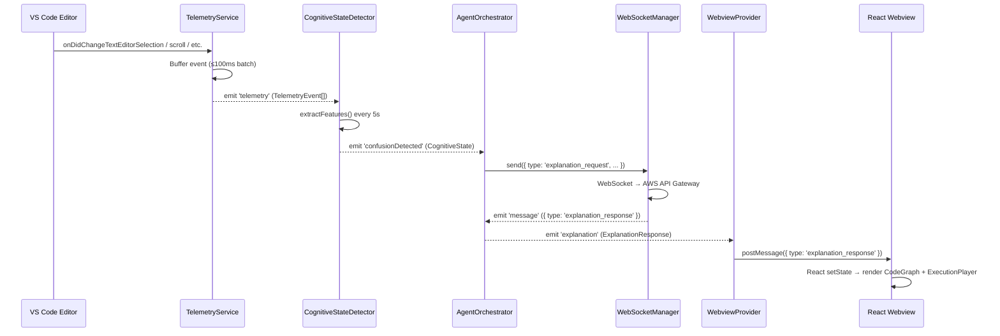

I have created the following plan after thorough exploration and analysis of the codebase. Follow the below plan verbatim. Trust the files and references. Do not re-verify what's written in the plan. Explore only when absolutely necessary. First implement all the proposed file changes and then I'll review all the changes together at the end.

## Observations

The monorepo uses npm workspaces + Turborepo. The shared package (`@cognitive-compass/shared`) is already built out with strict TypeScript exports. Key type notes:
- `DataNode.type` in shared types is `variable | function | class | module | parameter | return` (not the spec's `input | process | output | condition | loop | datastore`) — color mapping in `CodeGraph.tsx` must use the **actual shared union**.
- `WebSocketMessageType` is `'telemetry' | 'cognitive_state' | 'explanation_request' | 'explanation_response' | 'error'` — use `'explanation_request'` (not `'request_explanation'`) and `'cognitive_state'` (not `'cognitive_state_update'`) when sending/receiving.
- `encrypt()` in shared is **`async`**, so all call sites must `await` it.

## Approach

Create all 13 files under `apps/vscode-extension/` sequentially from the outermost config files inward, ensuring each layer (config → services → commands → providers → webviews → build) builds on what precedes it. Shared types are imported via the `@cognitive-compass/shared` workspace package. A `RealTimePredictor` stub interface is defined locally (File 42 doesn't exist yet).

---

## Implementation Steps

### File 16 — `apps/vscode-extension/package.json`

Create the VS Code extension manifest:

- `name`: `cognitive-compass`, `displayName`: `Cognitive Compass`, `version`: `0.1.0`, `publisher`: `cognitive-compass-team`
- `engines.vscode`: `^1.85.0`
- `categories`: `["Other", "Machine Learning"]`
- `activationEvents`: `["onStartupFinished"]`
- `main`: `./dist/extension.js`
- `contributes.commands`: three entries — `cognitiveCompass.explain` ("Explain Current Code"), `cognitiveCompass.showPanel` ("Show Cognitive Compass"), `cognitiveCompass.toggleTelemetry` ("Toggle Telemetry")
- `contributes.viewsContainers.activitybar`: one container `cognitiveCompass` with an icon path (`resources/icon.svg`) and title "Cognitive Compass"
- `contributes.views.cognitiveCompass`: one tree view `cognitiveCompassPanel` with type `webview`
- `scripts`: `"compile": "webpack --mode production"`, `"watch": "webpack --watch"`, `"package": "vsce package"`, `"lint": "eslint src --ext .ts,.tsx"`
- `dependencies`: `@aws-sdk/client-bedrock-runtime`, `react`, `react-dom`, `three`, `@react-three/fiber`, `@react-three/drei`, `zod`, `pino`, `ws`, `@cognitive-compass/shared` (workspace reference `"*"`)
- `devDependencies`: `@types/vscode@^1.85.0`, `@types/react`, `@types/react-dom`, `@types/three`, `@types/ws`, `typescript@^5.3.3`, `webpack`, `webpack-cli`, `ts-loader`, `css-loader`, `style-loader`, `@vscode/vsce`

---

### File 17 — `apps/vscode-extension/tsconfig.json`

Create TypeScript configuration:

- `compilerOptions.target`: `ES2020`, `module`: `commonjs`, `lib`: `["ES2020"]`
- `strict: true`, `noImplicitAny: true`, `strictNullChecks: true`, `noUnusedLocals: true`, `noUnusedParameters: true`, `noImplicitReturns: true`
- `esModuleInterop: true`, `skipLibCheck: true`
- `outDir: ./dist`, `rootDir: ./src`
- `paths`: `{ "@cognitive-compass/shared/*": ["../../shared/*"] }` — so TypeScript resolves workspace imports
- `include`: `["src/**/*"]`

---

### File 18 — `apps/vscode-extension/src/extension.ts`

The VS Code extension entry point. Exports `activate(context: vscode.ExtensionContext)` and `deactivate()`.

**Module-level setup:**
- Create a `pino` logger instance at module level (named `logger`) for internal logging. Never use `console.log`.

**`activate(context)`:**
1. Instantiate services in dependency order:
   - `telemetryService = new TelemetryService()`
   - `cognitiveStateDetector = new CognitiveStateDetector(telemetryService)`
   - `webSocketManager = new WebSocketManager()`
   - `agentOrchestrator = new AgentOrchestrator(cognitiveStateDetector, webSocketManager)`
   - `webviewProvider = new WebviewProvider(context.extensionUri, agentOrchestrator)`
2. Wire up the `AgentOrchestrator` → `WebviewProvider` bridge: listen to `agentOrchestrator.on('explanation', ...)` and call `webviewProvider.postMessage(...)`.
3. Register the three commands via `vscode.commands.registerCommand`, delegating to the functions from `CommandHandlers`.
4. Register `webviewProvider` via `vscode.window.registerWebviewViewProvider('cognitiveCompassPanel', webviewProvider)`.
5. Push all service instances and command registrations to `context.subscriptions`.
6. Call `vscode.window.showInformationMessage('Cognitive Compass activated')`.

**`deactivate()`:**
- Call `dispose()` on each service (telemetry, detector, websocket, orchestrator, webview).

---

### File 19 — `apps/vscode-extension/src/services/TelemetryService.ts`

Extends `EventEmitter`, implements `vscode.Disposable`. Captures all editor events and emits encrypted batches every 100ms.

**Named constants (top of file):**
```
BATCH_INTERVAL_MS = 100
MAX_BUFFER_SIZE = 1000
```

**Private fields:** `_disposables`, `_buffer: TelemetryEvent[]`, `_timer: NodeJS.Timeout | undefined`, `_enabled: boolean`, `_sessionId: string`, `_userId: string`

**Constructor:**
- Generate `_sessionId` using `crypto.randomUUID()` (Node.js built-in, no external UUID library needed)
- Set `_userId = vscode.env.machineId`
- Register six VS Code event listeners, each calling `_createEvent()` and pushing to `_buffer` (guard with `MAX_BUFFER_SIZE` cap):
  - `vscode.window.onDidChangeTextEditorSelection` → `EventType = 'selection'`, `SelectionPayload`
  - `vscode.workspace.onDidChangeTextDocument` → `EventType = 'keypress'`, `KeypressPayload` (derive from `event.contentChanges[0]`: `isInsert = contentChanges[0].text.length > 0`, `isDelete = contentChanges[0].rangeLength > 0`, `isUndo/isRedo` inferred from VS Code's `TextDocumentChangeReason`)
  - `vscode.window.onDidChangeActiveTextEditor` → two events: `'tab_switch'` (`TabSwitchPayload`) and `'file'` (`FilePayload` with action `'open'`)
  - `vscode.workspace.onDidOpenTextDocument` → `'file'` / action `'open'`
  - `vscode.workspace.onDidCloseTextDocument` → `'file'` / action `'close'`
  - `vscode.window.onDidChangeTextEditorVisibleRanges` → `'scroll'`, `ScrollPayload`
- Start `_timer = setInterval(() => this._flush(), BATCH_INTERVAL_MS)`
- Push each listener disposable to `_disposables`

**`_createEvent(type, payload, editor?)`:** Returns a `TelemetryEvent` with `timestamp: Date.now()`, `userId: _userId`, `sessionId: _sessionId`, `projectId` (derive from `vscode.workspace.workspaceFolders?.[0]?.name ?? 'unknown'`), `eventType: type`, `payload`

**`_flush()`:**
- Return early if `!_enabled || _buffer.length === 0`
- Take snapshot: `const events = [..._buffer]`, clear `_buffer = []`
- Serialize to JSON string, then call `await encrypt(JSON.stringify(events), this._userId)` (import `encrypt` from `@cognitive-compass/shared/utils/encryption`)
- Emit `'telemetry'` event with the encrypted string and the raw events for local consumers (emit two separate events: `'telemetryEncrypted'` with the ciphertext for transmission, `'telemetry'` with raw `TelemetryEvent[]` for `CognitiveStateDetector`)

**`enable()`, `disable()`, `toggle()`:** Set `_enabled`.

**`dispose()`:** `clearInterval(_timer)`, dispose `_disposables`, `removeAllListeners()`

**Typed `EventEmitter` overloads:** Declare `on(event: 'telemetry', listener: (events: TelemetryEvent[]) => void): this` and `emit(event: 'telemetry', events: TelemetryEvent[]): boolean` as typed method overloads.

---

### File 20 — `apps/vscode-extension/src/services/CognitiveStateDetector.ts`

Extends `EventEmitter`, implements `vscode.Disposable`.

**Named constants:**
```
BUFFER_WINDOW_MS = 300000
CONFUSION_THRESHOLD = 0.7
EVALUATION_INTERVAL_MS = 5000
```

**Local stub interface** (since `apps/ml-service/inference/real-time-predictor.ts` doesn't exist yet):
```typescript
interface RealTimePredictor {
  predict(features: number[]): Promise<{ state: CognitiveStateState; confidence: number }>
}
```
Provide a `LocalPredictor` class implementing this interface that uses thresholds on the raw feature vector as a fallback (e.g., if `scrollOscillation > CONFUSION_THRESHOLD` → state `'confused'`).

**Private fields:** `_eventBuffer: TelemetryEvent[]`, `_currentState: CognitiveState`, `_predictor: RealTimePredictor`, `_evaluationTimer: NodeJS.Timeout`, `_disposables`

**Constructor(`telemetryService`):**
- Initialize `_predictor = new LocalPredictor()`
- Listen on `telemetryService.on('telemetry', (events) => { ... })` — append events to `_eventBuffer`, then prune events older than `BUFFER_WINDOW_MS`
- Start `_evaluationTimer = setInterval(() => this._evaluate(), EVALUATION_INTERVAL_MS)`

**`_evaluate()`** (private, `async`):
- Call `extractFeatures(_eventBuffer)` (imported from `@cognitive-compass/shared/utils/telemetry-helpers`)
- Call `calculateScrollOscillation(_eventBuffer)` and `detectLongPause(_eventBuffer)` for quick local signals
- Call `await _predictor.predict(features)` to get `{ state, confidence }`
- Build a `CognitiveState` object with `detectedSignals` from local checks
- Emit `'stateChange'` with the new `CognitiveState`
- If `state === 'confused' && confidence > CONFUSION_THRESHOLD`: emit `'confusionDetected'` with the `CognitiveState`

**Typed emitter overloads:** `'stateChange'` → `(state: CognitiveState) => void`, `'confusionDetected'` → `(state: CognitiveState) => void`

**`dispose()`:** `clearInterval(_evaluationTimer)`, dispose `_disposables`, `removeAllListeners()`

---

### File 21 — `apps/vscode-extension/src/services/WebSocketManager.ts`

Extends `EventEmitter`, implements `vscode.Disposable`. Uses the `ws` npm package.

**Named constants:**
```
RECONNECT_DELAY_MS = 1000
MAX_RECONNECT_ATTEMPTS = 10
PING_INTERVAL_MS = 30000
BACKOFF_MULTIPLIER = 2
```

**Private fields:** `_ws: WebSocket | undefined`, `_reconnectAttempts: number = 0`, `_pingTimer: NodeJS.Timeout | undefined`, `_endpoint: string = ''`, `_queue: WebSocketMessage[]`, `_disposed: boolean = false`

**`connect(endpoint: string)`:**
- Store `_endpoint = endpoint`
- Instantiate `new WebSocket(endpoint)` from the `ws` package
- Register handlers:
  - `onopen`: reset `_reconnectAttempts = 0`, start `_pingTimer = setInterval(() => _ws?.ping(), PING_INTERVAL_MS)`, flush `_queue`, emit `'connected'`
  - `onmessage`: parse `JSON.parse(event.data as string)` as `WebSocketMessage`, validate with a Zod schema (define a `webSocketMessageSchema`), emit `'message'` with the parsed payload
  - `onerror`: log the error via the module-level pino logger, emit `'error'`
  - `onclose`: clear `_pingTimer`, if `!_disposed && _reconnectAttempts < MAX_RECONNECT_ATTEMPTS` call `_reconnect()`

**`send(message: WebSocketMessage)`:**
- If `_ws?.readyState === WebSocket.OPEN`: `_ws.send(JSON.stringify(message))`
- Otherwise: push to `_queue`

**`_reconnect()`** (private):
- Increment `_reconnectAttempts`
- Compute delay: `RECONNECT_DELAY_MS * (BACKOFF_MULTIPLIER ** _reconnectAttempts)`
- Use `setTimeout(() => this.connect(this._endpoint), delay)`

**Typed emitter overloads:** `'connected'`, `'message'` → `(msg: WebSocketMessage) => void`, `'error'` → `(err: Error) => void`

**`dispose()`:** Set `_disposed = true`, `clearInterval(_pingTimer)`, `_ws?.close(1000)`, `removeAllListeners()`

---

### File 22 — `apps/vscode-extension/src/services/AgentOrchestrator.ts`

Extends `EventEmitter`, implements `vscode.Disposable`.

**Constructor(`cognitiveStateDetector, webSocketManager`):**
- Listen to `cognitiveStateDetector.on('confusionDetected', (state) => { ... })`:
  - Get active editor via `vscode.window.activeTextEditor`
  - Build `ExplanationRequest`: `{ code: hashCode(selectedText)` (using `hashCode` from shared encryption util — never raw code), `language: editor.document.languageId`, `context: filePath + ':' + lineNumber`, `userQuery: 'auto_detected_confusion'`, `confusionSignals: state.detectedSignals`, `projectContext: workspaceName` }`
  - Send via `webSocketManager.send({ type: 'explanation_request', payload: request, timestamp: Date.now() })`
- Listen to `webSocketManager.on('message', (msg) => { ... })`:
  - Use a Zod schema to validate `msg.type`
  - If `msg.type === 'explanation_response'`: validate payload as `ExplanationResponse`, emit `'explanation'`
  - If `msg.type === 'cognitive_state'`: emit `'stateUpdate'`

**`requestExplanation(code: string, language: string)`:**
- Validate: active editor exists, `code` is non-empty string, `language` is a known VS Code `languageId`
- Build and send `ExplanationRequest` same as above (using `hashCode` for code content)
- Return `Result<void, Error>`

**Typed emitter overloads:** `'explanation'` → `(response: ExplanationResponse) => void`, `'stateUpdate'` → `(state: CognitiveState) => void`

**`dispose()`:** `removeAllListeners()`

---

### File 23 — `apps/vscode-extension/src/commands/CommandHandlers.ts`

Three exported standalone functions (no class):

**`handleExplainCommand(orchestrator, webviewProvider)`:**
- Wrap in try/catch returning `Result<void, Error>`
- Get `vscode.window.activeTextEditor` — return error result if none
- Get selected text via `editor.document.getText(editor.selection)` or current line text if selection is empty
- Call `orchestrator.requestExplanation(text, editor.document.languageId)`

**`handleShowPanelCommand(webviewProvider)`:**
- Wrap in try/catch returning `Result<void, Error>`
- Call `webviewProvider.reveal()`

**`handleToggleTelemetryCommand(telemetryService)`:**
- Wrap in try/catch returning `Result<void, Error>`
- Call `telemetryService.toggle()`
- Show `vscode.window.setStatusBarMessage('Cognitive Compass Telemetry: ON')` or `'...OFF'` depending on new state
- Return `{ success: true, data: undefined }`

---

### File 24 — `apps/vscode-extension/src/providers/WebviewProvider.ts`

Implements both `vscode.WebviewViewProvider` and `vscode.Disposable`.

**Private fields:** `_view: vscode.WebviewView | undefined`, `_extensionUri: vscode.Uri`, `_orchestrator: AgentOrchestrator`, `_disposables: vscode.Disposable[]`

**Constructor:** Store `extensionUri` and `orchestrator`. Listen to `orchestrator.on('explanation', (response) => this.postMessage({ type: 'explanation_response', payload: response, timestamp: Date.now() }))`.

**`resolveWebviewView(webviewView, context, token)`:**
- Set `webviewView.webview.options = { enableScripts: true, localResourceRoots: [this._extensionUri] }`
- Set `webviewView.webview.html = this._getHtmlContent(webviewView.webview)`
- Store `_view = webviewView`
- Register `webviewView.webview.onDidReceiveMessage((msg) => this._handleWebviewMessage(msg))` — push to `_disposables`

**`_getHtmlContent(webview)`:**
- Compute `webview.asWebviewUri(vscode.Uri.joinPath(this._extensionUri, 'dist', 'webview.js'))` for the script URI
- Return HTML string with:
  - `<meta http-equiv="Content-Security-Policy" content="default-src 'none'; script-src ${webview.cspSource}; style-src 'unsafe-inline';">`
  - `<div id="root"></div>`
  - `<script src="${scriptUri}"></script>`

**`_handleWebviewMessage(msg)`** (private):
- Validate `msg` with Zod (typed discriminated union of message types from webview: `'nodeSelected'`, `'highlightLine'`, etc.)
- For `'highlightLine'`: call `vscode.commands.executeCommand('editor.action.goToLocations', ...)` or `editor.revealRange()`

**`postMessage(message: WebSocketMessage)`:** `this._view?.webview.postMessage(message)`

**`reveal()`:** `this._view?.show(true)`

**`dispose()`:** dispose `_disposables`

---

### File 25 — `apps/vscode-extension/src/webviews/3d-visualization/index.tsx`

React webview entry point. Uses **inline styles only** (no CSS imports).

**`acquireVsCodeApi` type declaration:** Declare `interface VsCodeApi { postMessage(msg: unknown): void }` and `declare function acquireVsCodeApi(): VsCodeApi` at top of file. Call `const vscode = acquireVsCodeApi()` once and attach to `window` (via `(window as Window & { vscode: VsCodeApi }).vscode = vscode`).

**`App` component:**
- State: `explanation: ExplanationResponse | null = null`, `cognitiveState: CognitiveState | null = null`
- `useEffect`: add `window.addEventListener('message', (event) => { ... })` — parse `event.data` as `WebSocketMessage`, if `type === 'explanation_response'` set `explanation`, if `type === 'cognitive_state'` set `cognitiveState`. Return cleanup removing the listener.
- Render:
  - If no `explanation`: a centered div with inline styles showing "Waiting for confusion detection..."
  - Otherwise: `<CodeGraph dataFlow={explanation.dataFlow} />` and `<ExecutionPlayer steps={explanation.codeWalkthrough} />`

**Entry:** `ReactDOM.createRoot(document.getElementById('root')!).render(<App />)`

---

### File 26 — `apps/vscode-extension/src/webviews/3d-visualization/CodeGraph.tsx`

3D node-edge graph. Props: `{ dataFlow: DataFlowGraph | undefined }`.

**`calculateNodePositions(nodes: DataNode[]): Record<string, [number, number, number]>`** — pure function, places nodes in a deterministic circular layout:
- Spread nodes evenly around a circle (`radius = 3`), using index to compute angle: `angle = (index / nodes.length) * 2 * Math.PI`
- Returns `{ [node.id]: [Math.cos(angle) * radius, Math.sin(angle) * radius, 0] }`

**Node color map** (use the actual shared `DataNode.type` values):
```
variable → blue (#4fc1ff)
function → green (#4ec9b0)
class    → orange (#ce9178)
module   → yellow (#dcdcaa)
parameter → purple (#c586c0)
return   → red (#f44747)
```

**Component structure:**
- Return `null` if `!dataFlow`
- Return `<Canvas style={{ height: '300px' }}>` containing:
  - `<ambientLight intensity={0.5} />`
  - `<pointLight position={[10, 10, 10]} />`
  - `<OrbitControls />`
  - For each `DataNode` in `dataFlow.nodes`: a `<NodeMesh>` sub-component (extract to keep `CodeGraph` ≤ 50 lines)
  - For each `DataEdge` in `dataFlow.edges`: an `<EdgeLine>` sub-component

**`NodeMesh` sub-component** (`{ node, position, color, onSelect }` props):
- Renders `<mesh position={position} onClick={(e: ThreeEvent<MouseEvent>) => { e.stopPropagation(); onSelect(node.id); }}>`, `<sphereGeometry args={[0.3, 16, 16]} />`, `<meshStandardMaterial color={color} />`

**`EdgeLine` sub-component** (`{ from, to }` as `[number,number,number]` tuples):
- Creates `THREE.BufferGeometry` from `new THREE.Vector3(...from)` and `new THREE.Vector3(...to)` via `geometry.setFromPoints()`
- Renders `<primitive object={new THREE.Line(geometry, new THREE.LineBasicMaterial({ color: '#555555' }))} />`

**Click handler in `CodeGraph`:**
- `onSelect = (nodeId: string) => (window as Window & { vscode: VsCodeApi }).vscode.postMessage({ type: 'nodeSelected', nodeId })`

---

### File 27 — `apps/vscode-extension/src/webviews/3d-visualization/ExecutionPlayer.tsx`

Step-through player. Props: `{ steps: CodeStep[] | undefined }`.

**Named constant:** `PLAY_INTERVAL_MS = 2000`

**State:** `currentStep: number = 0`, `isPlaying: boolean = false`

**`useEffect` for auto-play:**
- If `isPlaying && steps && steps.length > 0`: set `interval = setInterval(() => setCurrentStep(s => Math.min(s + 1, steps.length - 1)), PLAY_INTERVAL_MS)`. When `currentStep` reaches last step, set `isPlaying = false`.
- Cleanup: `clearInterval(interval)`. Deps: `[isPlaying, steps, currentStep]`

**`useEffect` for line highlight:**
- When `currentStep` changes: send `(window as Window & { vscode: VsCodeApi }).vscode.postMessage({ type: 'highlightLine', lineNumber: steps[currentStep].lineNumber })`. Deps: `[currentStep, steps]`

**Render** (all inline styles):
- If `!steps || steps.length === 0`: return placeholder div
- Display current step data: `stepNumber`, `lineNumber`, `description`, `variables` rendered as a `<pre>{JSON.stringify(step.variables, null, 2)}</pre>`, `stdout` if present
- Controls: Previous button (`currentStep > 0`), Play/Pause toggle, Next button (`currentStep < steps.length - 1`), step counter `"Step {currentStep + 1} of {steps.length}"`

---

### File 28 — `apps/vscode-extension/webpack.config.js`

Two-config export (`module.exports = [extensionConfig, webviewConfig]`):

**`extensionConfig`:**
- `target: 'node'`
- `entry: './src/extension.ts'`
- `output: { path: path.resolve(__dirname, 'dist'), filename: 'extension.js', libraryTarget: 'commonjs2' }`
- `externals: { vscode: 'commonjs vscode' }`
- `resolve: { extensions: ['.ts', '.js'] }`
- `module.rules`: `{ test: /\.ts$/, use: 'ts-loader', exclude: /node_modules/ }`
- `mode: process.env.NODE_ENV || 'production'`
- `devtool: 'source-map'`

**`webviewConfig`:**
- `target: 'web'`
- `entry: './src/webviews/3d-visualization/index.tsx'`
- `output: { path: path.resolve(__dirname, 'dist'), filename: 'webview.js' }`
- No `externals` (webview has no `vscode` module access)
- `resolve: { extensions: ['.tsx', '.ts', '.js'] }`
- `module.rules`:
  - `{ test: /\.tsx?$/, use: 'ts-loader', exclude: /node_modules/ }`
  - `{ test: /\.css$/, use: ['style-loader', 'css-loader'] }`
- `mode: process.env.NODE_ENV || 'production'`

---

## Cross-Cutting Concerns



### Key Integration Details

| Concern | Solution |
|---|---|
| Shared type imports | `import { TelemetryEvent, ... } from '@cognitive-compass/shared/types'` |
| `encrypt()` is async | All `_flush()` calls must be `async`, mark `_flush` as `async` in `TelemetryService` |
| `WebSocketMessageType` mismatch | Use `'explanation_request'` (not `'request_explanation'`) per shared type definition |
| `DataNode.type` color map | Map `variable\|function\|class\|module\|parameter\|return` (actual shared type), not spec's `input\|process\|...` |
| Code never transmitted raw | `AgentOrchestrator` uses `hashCode(code)` from shared encryption util; `TelemetryService` encrypts full payload |
| `RealTimePredictor` stub | Define local `interface RealTimePredictor` + `class LocalPredictor` in `CognitiveStateDetector.ts` until Phase 5 lands |
| Webview `acquireVsCodeApi` | Declare once at module top in `index.tsx`, attach to `window`, import in child components via the typed `window` cast |
| Resources icon | Create `apps/vscode-extension/resources/icon.svg` placeholder (required by `viewsContainers` contribution point) |