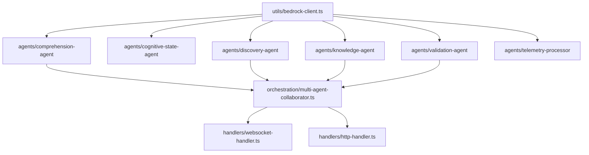

I have created the following plan after thorough exploration and analysis of the codebase. Follow the below plan verbatim. Trust the files and references. Do not re-verify what's written in the plan. Explore only when absolutely necessary. First implement all the proposed file changes and then I'll review all the changes together at the end.

## Observations

The shared foundation is complete and exports: `Result<T,E>`, `ExplanationRequest`, `ExplanationResponse`, `TelemetryEvent`, `CognitiveState`, `ConfusionSignal`, `DataFlowGraph`, `CodeStep`, `WebSocketMessage`, `DeveloperSession`, `AgentMessage`, plus helpers `extractFeatures`, `calculateScrollOscillation`, `detectLongPause`, and constants like `NOVA_PRO_MODEL_ID`, `TITAN_EMBED_MODEL_ID`, `NEPTUNE_PORT`, `VECTOR_DIMENSIONS`. The workspace uses npm workspaces + Turborepo. The `apps/api-service/` directory does not yet exist.

## Approach

Build all 11 files bottom-up: shared utility first (`bedrock-client.ts`), then the 5 agent Lambdas that depend on it, then the orchestration module that invokes agents, then the two entry-point handlers that depend on the orchestrator, and finally the package manifests. This ensures each file's dependencies are defined before they are referenced.



---

## Implementation Steps

### Step 1 — `apps/api-service/package.json`

Create the file at `file:apps/api-service/package.json` with the following shape:

- `name`: `@cognitive-compass/api-service`, `version`: `0.1.0`, `private`: true, `main`: `./dist/index.js`
- **scripts**: `build` → `tsc --project tsconfig.json`, `test` → `jest --coverage`, `lint` → `eslint src --ext .ts`, `deploy` → `serverless deploy`
- **dependencies** (all `latest` unless specified):
  - `@aws-sdk/client-bedrock-agent-runtime`
  - `@aws-sdk/client-bedrock-runtime`
  - `@aws-sdk/client-kinesis`
  - `@aws-sdk/client-neptune-graph`
  - `@aws-sdk/client-opensearchserverless`
  - `@aws-sdk/client-timestream-write`
  - `@aws-sdk/client-dynamodb`
  - `@aws-sdk/lib-dynamodb`
  - `@aws-sdk/client-sagemaker-runtime` *(required by cognitive-state-agent — not in the original list but specified in File 31)*
  - `@aws-sdk/client-lambda` *(required by multi-agent-collaborator fallback and orchestrator — add it)*
  - `@aws-sdk/client-api-gateway-management-api` *(required by websocket-handler)*
  - `@opensearch-project/opensearch`
  - `@cognitive-compass/shared`: `"*"`
  - `pino`, `zod`, `uuid`: `^9.0.0`
- **devDependencies**: `typescript: ^5.3.3`, `@types/node: ^20.10.0`, `@types/aws-lambda`, `@types/uuid`, `jest`, `ts-jest`, `@types/jest`, `eslint: ^8.56.0`
- `engines`: `{ "node": ">=20.0.0" }`

---

### Step 2 — `apps/api-service/tsconfig.json`

Create `file:apps/api-service/tsconfig.json`:

- `compilerOptions`: `target: ES2020`, `module: commonjs`, `lib: ["ES2020"]`, `strict: true`, `noImplicitAny: true`, `strictNullChecks: true`, `noUnusedLocals: true`, `noUnusedParameters: true`, `noImplicitReturns: true`, `esModuleInterop: true`, `skipLibCheck: true`, `outDir: ./dist`, `rootDir: ./src`
- `paths`: `{ "@cognitive-compass/shared/*": ["../../shared/*"] }` — this aligns with the workspace layout where `shared/` is at repo root
- `include`: `["src/**/*"]`

---

### Step 3 — `apps/api-service/src/utils/bedrock-client.ts`

Create `file:apps/api-service/src/utils/bedrock-client.ts`.

**Class: `BedrockClient` (singleton)**

Named constants at module top:
- `MAX_RETRY_ATTEMPTS = 3`
- `BASE_RETRY_DELAY_MS = 1000`
- `BACKOFF_MULTIPLIER = 2`
- `TITAN_EMBED_MODEL_ID = 'amazon.titan-embed-text-v2:0'`
- `TITAN_EMBED_MAX_CHARS = 8192`

Constructor (private):
- Initialize `BedrockRuntimeClient` from `@aws-sdk/client-bedrock-runtime`
- Initialize `BedrockAgentRuntimeClient` from `@aws-sdk/client-bedrock-agent-runtime`
- Store both as private readonly fields

Static `getInstance()` method returns the singleton instance.

**Private helper `sleep(ms: number): Promise<void>`** — wraps `setTimeout` in a Promise.

**Private helper `isRetryableError(error: unknown): boolean`** — returns true if the error name is `ThrottlingException` or `ServiceUnavailableException`.

**Private helper `withRetry<T>(operation: () => Promise<T>): Promise<Result<T, Error>>`** — implements exponential backoff loop for up to `MAX_RETRY_ATTEMPTS` iterations, calling `sleep(BASE_RETRY_DELAY_MS * BACKOFF_MULTIPLIER ** attempt)` on retryable errors; wraps all in try/catch to return `Result<T, Error>`.

**`invokeModel(modelId, prompt, maxTokens, temperature): Promise<Result<string, Error>>`**:
- Build `ConverseCommandInput` using `{ messages: [{ role: 'user', content: [{ text: prompt }] }], inferenceConfig: { maxTokens, temperature } }` — import `ConverseCommand`, `ConverseCommandInput`, `ConverseCommandOutput` from `@aws-sdk/client-bedrock-runtime`
- Call through `withRetry`
- Extract text from `output.output.message.content[0].text` — guard each access with explicit type narrowing (no `any`)
- Return `Result<string, Error>`

**`invokeAgent(agentId, agentAliasId, sessionId, inputText): Promise<Result<string, Error>>`**:
- Build `InvokeAgentCommand` input from `@aws-sdk/client-bedrock-agent-runtime`
- Send via `this.agentRuntimeClient`
- Iterate the `AsyncIterable<ResponseStream>` from `response.completion`, accumulate chunks where `chunk.chunk?.bytes` exists; decode with `new TextDecoder()`
- Return accumulated string via `Result`

**`generateEmbedding(text: string): Promise<Result<number[], Error>>`**:
- Truncate `text` to `TITAN_EMBED_MAX_CHARS` characters before use
- Call `InvokeModelCommand` with `modelId: TITAN_EMBED_MODEL_ID`, body: `JSON.stringify({ inputText: truncatedText })`
- Decode response body with `TextDecoder`, `JSON.parse`, extract `embedding` array (type as `number[]` after Zod validation)
- Wrap in `withRetry`

Import `Result` from `@cognitive-compass/shared/types`.

---

### Step 4 — `apps/api-service/src/agents/comprehension-agent/index.ts`

Create `file:apps/api-service/src/agents/comprehension-agent/index.ts`.

Named constants:
- `MODEL_ID = 'amazon.nova-pro-v1:0'`
- `MAX_TOKENS = 4096`
- `TEMPERATURE = 0.1`

**Zod schema `ExplanationRequestSchema`** — mirrors the `ExplanationRequest` interface from shared types. Field-by-field: `code: z.string()`, `language: z.string()`, `context: z.string()`, `userQuery: z.string()`, `confusionSignals: z.array(...)`, `projectContext: z.string().optional()`.

**Zod schema `ExplanationResponseSchema`** — mirrors `ExplanationResponse` with nested schemas for `DataFlowGraph` (nodes and edges) and `CodeStep[]`.

**`buildPrompt(request: ExplanationRequest): string`** — constructs a structured prompt instructing Nova Pro to return a JSON object with keys: `explanation`, `keyConcepts`, `dataFlow` (nodes/edges), `codeWalkthrough`, `confidence`, `reasoningTrace`, `suggestedQuestions` (3 items), `estimatedReadTime`. Embed `request.code`, `request.language`, `request.context`, and `request.userQuery` in the prompt.

**`parseModelResponse(raw: string): Result<ExplanationResponse, Error>`** — `JSON.parse(raw)` in try/catch, then parse with `ExplanationResponseSchema.safeParse()`. On failure, return `{ success: false, error }`. On success, augment with `id: uuidv4()` and `timestamp: Date.now()`.

**`handler(event: APIGatewayProxyEvent, context: Context): Promise<Result<ExplanationResponse, Error>>`**:
1. Initialize pino logger with `{ requestId: context.awsRequestId }`
2. Parse `event.body` → validate with `ExplanationRequestSchema.safeParse()` — return early on failure
3. Call `BedrockClient.getInstance().invokeModel(MODEL_ID, buildPrompt(request), MAX_TOKENS, TEMPERATURE)`
4. On success, call `parseModelResponse(modelResult.data)`
5. Return the `Result`

Import `BedrockClient` from `../../utils/bedrock-client`. Import `uuidv4` from `uuid`. Import `ExplanationRequest`, `ExplanationResponse`, `Result` from `@cognitive-compass/shared/types`.

---

### Step 5 — `apps/api-service/src/agents/cognitive-state-agent/index.ts`

Create `file:apps/api-service/src/agents/cognitive-state-agent/index.ts`.

Named constants:
- `SAGEMAKER_ENDPOINT_NAME = process.env['SAGEMAKER_ENDPOINT_NAME'] ?? ''`
- `SCROLL_CONFUSION_THRESHOLD = 0.7`
- `TIMESTREAM_DATABASE = 'cognitive-telemetry'` (from `AWS_CONFIG.TIMESTREAM.DATABASE_NAME`)
- `TIMESTREAM_TABLE = 'interaction-events'`

**Zod schema `TelemetryEventBatchSchema`** — `z.array(...)` with per-field validation of `TelemetryEvent`.

**`callSageMaker(features: number[]): Promise<Result<{ state: string; confidence: number; predictedTimeToHelp: number }, Error>>`**:
- Initialize `SageMakerRuntimeClient` from `@aws-sdk/client-sagemaker-runtime`
- Use `InvokeEndpointCommand` with `EndpointName: SAGEMAKER_ENDPOINT_NAME`, `Body: Buffer.from(JSON.stringify(features))`, `ContentType: 'application/json'`
- Decode response body, `JSON.parse`, validate shape with a Zod schema before returning

**`localFallbackDetection(events: TelemetryEvent[], features: number[]): CognitiveState`** — if `calculateScrollOscillation(events) > SCROLL_CONFUSION_THRESHOLD`, return confused state; otherwise `exploring`. Build and return a full `CognitiveState` object with `detectedSignals` derived from `calculateScrollOscillation` and `detectLongPause`.

**`writeToTimestream(state: CognitiveState, userId: string, sessionId: string): Promise<void>`** — use `TimestreamWriteClient` + `WriteRecordsCommand` from `@aws-sdk/client-timestream-write`. Construct the record with the four `Dimensions` and `MeasureValues` per spec. Wrap in try/catch, log errors via pino only.

**`handler(event: APIGatewayProxyEvent, context: Context): Promise<Result<CognitiveState, Error>>`**:
1. Parse and validate `event.body` using `TelemetryEventBatchSchema`
2. `const features = extractFeatures(events)` (50-dim)
3. `const oscillation = calculateScrollOscillation(events)`; `const pause = detectLongPause(events)`
4. Attempt SageMaker call; on failure fall back to `localFallbackDetection`
5. Build `CognitiveState` with `detectedSignals` from detected oscillation/pause
6. Call `writeToTimestream(...)` — fire and forget (do not await the returned promise to block the response, but do `void` it to satisfy strict mode)
7. Return `Result`

Import `extractFeatures`, `calculateScrollOscillation`, `detectLongPause` from `@cognitive-compass/shared/utils/telemetry-helpers`.

---

### Step 6 — `apps/api-service/src/agents/discovery-agent/index.ts`

Create `file:apps/api-service/src/agents/discovery-agent/index.ts`.

Named constants:
- `NEPTUNE_ENDPOINT = process.env['NEPTUNE_ENDPOINT'] ?? ''`
- `NEPTUNE_PORT = 8182` (matches `shared/constants/aws.ts`)
- `MAX_RETRY_ATTEMPTS = 3`
- `BASE_RETRY_DELAY_MS = 1000`
- `BACKOFF_MULTIPLIER = 2`

**Zod schema `DiscoveryQuerySchema`**: `{ filePath: z.string(), symbol: z.string(), depth: z.number().int().min(1).max(5) }`.

**`buildNeptuneUrl(): string`** — constructs `http://${NEPTUNE_ENDPOINT}:${NEPTUNE_PORT}/openCypher`.

**`buildTraversalQuery(symbol: string, depth: number): string`** — returns an openCypher query string that matches nodes named `symbol`, traverses up to `depth` hops for callers/callees/dependencies, and returns connected nodes and edges.

**`signNeptuneRequest(body: string, url: string): Promise<Headers>`** — uses `@aws-sdk/signature-v4` (import `SignatureV4` from `@aws-sdk/signature-v4`) together with `Sha256` from `@aws-crypto/sha256-js` or Node's built-in `crypto` via `createHash`. Signs the POST request with service name `neptune-db` and region from `process.env['AWS_REGION']`. Returns a `Headers`-compatible record.

> Note: `@aws-sdk/signature-v4` is a transitive dependency of all `@aws-sdk/*` v3 packages already in the dependency tree — no separate entry needed in `package.json`.

**`executeQuery(query: string): Promise<Result<unknown, Error>>`** — performs `fetch` POST to Neptune with signed headers, parses JSON response, wraps in try/catch. Implements retry loop with exponential backoff using the local constants (3 attempts).

**`mapToDataFlowGraph(neptuneResponse: unknown): DataFlowGraph`** — type-guards the response (use `z.object(...)`) and maps Neptune's node/edge structure to `DataFlowGraph` (`DataNode[]`, `DataEdge[]`). Returns empty graph `{ nodes: [], edges: [] }` if mapping fails.

**`handler(event: APIGatewayProxyEvent, context: Context): Promise<Result<DataFlowGraph, Error>>`**:
1. Validate `event.body` with `DiscoveryQuerySchema`
2. Build and execute the openCypher query
3. On success: map to `DataFlowGraph` and return
4. On any failure: log error, return `{ success: true, data: { nodes: [], edges: [] } }` — never throw

---

### Step 7 — `apps/api-service/src/agents/knowledge-agent/index.ts`

Create `file:apps/api-service/src/agents/knowledge-agent/index.ts`.

Named constants:
- `OPENSEARCH_ENDPOINT = process.env['OPENSEARCH_ENDPOINT'] ?? ''`
- `INDEX_NAME = 'cc-knowledge-index'`
- `VECTOR_DIMENSIONS = 1536`
- `TOP_K = 5`
- `TITAN_EMBED_MODEL_ID = 'amazon.titan-embed-text-v2:0'`

**`KnowledgeDocument` interface (local)**: `{ id: string; explanation: string; keyConcepts: string[]; embedding: number[]; timestamp: number; filePath: string; language: string }`.

**Zod schema `KnowledgePayloadSchema`**: discriminated union on `action: z.enum(['store', 'retrieve'])` with separate shapes for each mode.

**`buildOpenSearchClient()`**: returns a `Client` from `@opensearch-project/opensearch` constructed with `{ node: OPENSEARCH_ENDPOINT, Connection: AwsSigV4SignerConnection }`. Use the AWS SigV4 signer option from `@opensearch-project/opensearch/aws` (the package ships a built-in AWS auth connector — use `AwsSigV4SignerOptions` with `service: 'aoss'` for OpenSearch Serverless, region from env). Keep the client construction in a factory function — do not instantiate at module top level (to avoid cold-start issues and to allow testing).

**`storeExplanation(explanationResponse: ExplanationResponse, client: Client): Promise<Result<string, Error>>`**:
1. Call `BedrockClient.getInstance().generateEmbedding(explanationResponse.explanation)`
2. Build a `KnowledgeDocument` — generate `id` with `uuidv4()`
3. `client.index({ index: INDEX_NAME, id, body: document })`
4. Wrap all in try/catch, return `Result<string, Error>` (the string is the stored document `id`)

**`retrieveExplanations(query: string, client: Client): Promise<Result<KnowledgeDocument[], Error>>`**:
1. Call `BedrockClient.getInstance().generateEmbedding(query)`
2. Build k-NN query: `{ query: { knn: { embedding: { vector: embeddingArray, k: TOP_K } } } }`
3. `client.search({ index: INDEX_NAME, body: knnQuery })`
4. Map hits to `KnowledgeDocument[]` with explicit type narrowing (no `any`)

**`handler(event: APIGatewayProxyEvent, context: Context): Promise<Result<unknown, Error>>`**:
1. Parse and validate payload with `KnowledgePayloadSchema`
2. Build client
3. Dispatch to `storeExplanation` or `retrieveExplanations` based on `payload.action`
4. Return `Result`

---

### Step 8 — `apps/api-service/src/agents/validation-agent/index.ts`

Create `file:apps/api-service/src/agents/validation-agent/index.ts`.

Named constants:
- `MODEL_ID = 'amazon.nova-pro-v1:0'`
- `QUIZ_QUESTION_COUNT = 3`
- `MAX_TOKENS = 2048`
- `TEMPERATURE = 0.3`

**`QuizQuestion` interface (local or exportable)**:
```
{ question: string; options: [string, string, string, string]; correctIndex: number; explanation: string }
```

**Zod schema `QuizQuestionSchema`** — validates the above shape. `correctIndex: z.number().int().min(0).max(3)`.

**Zod schema `QuizResponseSchema`** — `z.array(QuizQuestionSchema).length(QUIZ_QUESTION_COUNT)`.

**Zod schema `ExplanationResponseInputSchema`** — mirrors `ExplanationResponse` fields needed for the prompt.

**`buildQuizPrompt(explanationResponse: ExplanationResponse): string`** — instructs Nova Pro to return a valid JSON array of exactly `QUIZ_QUESTION_COUNT` multiple-choice questions based on `explanationResponse.explanation` and `explanationResponse.keyConcepts`. Specify the exact JSON schema in the prompt to constrain output.

**`parseQuizResponse(raw: string): Result<QuizQuestion[], Error>`** — `JSON.parse` in try/catch, then `QuizResponseSchema.safeParse()`. On failure, return `{ success: true, data: [] }` and log the parse error (per spec: "return empty questions array with error logged, never throw").

**`handler(event: APIGatewayProxyEvent, context: Context): Promise<Result<{ questions: QuizQuestion[]; explanationId: string }, Error>>`**:
1. Parse and validate `event.body` as `ExplanationResponse` using `ExplanationResponseInputSchema`
2. Call `BedrockClient.getInstance().invokeModel(MODEL_ID, buildQuizPrompt(response), MAX_TOKENS, TEMPERATURE)`
3. Parse model output with `parseQuizResponse`
4. Return `{ questions, explanationId: response.id }`

---

### Step 9 — `apps/api-service/src/agents/telemetry-processor/index.ts`

Create `file:apps/api-service/src/agents/telemetry-processor/index.ts`.

Named constants:
- `TIMESTREAM_DATABASE = process.env['TIMESTREAM_DATABASE'] ?? 'cognitive-telemetry'`
- `TIMESTREAM_TABLE = process.env['TIMESTREAM_TABLE'] ?? 'interaction-events'`
- `COGNITIVE_STATE_LAMBDA = process.env['COGNITIVE_STATE_LAMBDA_ARN'] ?? ''`

**Zod schema `TelemetryEventSchema`** — validates a single `TelemetryEvent`.

**`decodeRecord(data: string): Result<TelemetryEvent[], Error>`** — decodes base64, `JSON.parse`, validates array with `z.array(TelemetryEventSchema).safeParse()`.

**`buildTimestreamRecord(event: TelemetryEvent): _Record`** (import `_Record` from `@aws-sdk/client-timestream-write`) — constructs the Timestream record per spec:
- `Dimensions`: `userId`, `sessionId`, `projectId`, `eventType`
- `MeasureName: 'telemetry_event'`, `MeasureValueType: 'MULTI'`
- `MeasureValues`: encode numeric fields (e.g., `lineNumber`, `columnNumber` as `DOUBLE` type)
- `Time: event.timestamp.toString()`, `TimeUnit: 'MILLISECONDS'`

**`writeToTimestream(records: _Record[]): Promise<void>`** — batch-writes via `TimestreamWriteClient` + `WriteRecordsCommand`. Wrap in try/catch and log on error (do not rethrow — partial failures are handled at the record level).

**`triggerCognitiveStateEvaluation(events: TelemetryEvent[]): void`** — fire-and-forget: use `LambdaClient` + `InvokeCommand` (from `@aws-sdk/client-lambda`) with `InvocationType: 'Event'` (async). Call `void lambdaClient.send(...)` — do not await. Log invocation via pino.

**`handler(event: KinesisStreamEvent, context: Context): Promise<KinesisStreamBatchResponse>`**:
1. Initialize pino logger with `{ requestId: context.awsRequestId }`
2. `const batchItemFailures: { itemIdentifier: string }[] = []`
3. For each record in `event.Records[]`:
   - Call `decodeRecord(record.kinesis.data)` — on failure, push `{ itemIdentifier: record.kinesis.sequenceNumber }` to `batchItemFailures` and `continue`
   - On success, build Timestream records and accumulate them
4. After loop: call `writeToTimestream(allRecords)` — if this fails, push all processed record sequence numbers to `batchItemFailures`
5. Call `triggerCognitiveStateEvaluation(allEvents)` (fire-and-forget)
6. Return `{ batchItemFailures }`

Import `KinesisStreamEvent`, `KinesisStreamBatchResponse`, `Context` from `@types/aws-lambda`.

---

### Step 10 — `apps/api-service/src/orchestration/multi-agent-collaborator.ts`

Create `file:apps/api-service/src/orchestration/multi-agent-collaborator.ts`.

This is **not** a Lambda handler — it is a plain TypeScript module.

Named constants:
- `AGENT_ID = process.env['BEDROCK_AGENT_ID'] ?? ''`
- `AGENT_ALIAS_ID = process.env['BEDROCK_AGENT_ALIAS_ID'] ?? ''`
- `COMPREHENSION_LAMBDA_ARN = process.env['COMPREHENSION_LAMBDA_ARN'] ?? ''`

**`OrchestrationRequest` interface**:
```
{ sessionId: string; userId: string; explanationRequest: ExplanationRequest; cognitiveState: CognitiveState }
```

**`buildAgentInput(request: OrchestrationRequest): string`** — serializes the request into a JSON string with context about cognitive state + explanation request, to be sent as `inputText` to the Bedrock agent.

**`invokeLambdaFallback(request: ExplanationRequest, logger: pino.Logger): Promise<Result<ExplanationResponse, Error>>`**:
- Use `LambdaClient` + `InvokeCommand` (from `@aws-sdk/client-lambda`) to synchronously invoke the comprehension Lambda ARN
- Decode the response payload, parse as `ExplanationResponse`, validate with Zod
- Return `Result`

**`orchestrate(request: OrchestrationRequest): Promise<Result<ExplanationResponse, Error>>`**:
1. Build a pino child logger with `{ sessionId: request.sessionId, correlationId: uuidv4() }`
2. Call `BedrockClient.getInstance().invokeAgent(AGENT_ID, AGENT_ALIAS_ID, request.sessionId, buildAgentInput(request))`
3. On success: parse the accumulated string as `ExplanationResponse`, validate with a Zod schema, return `Result`
4. On failure: log the error, call `invokeLambdaFallback(request.explanationRequest, logger)` as the direct fallback
5. Return the fallback result

---

### Step 11 — `apps/api-service/src/handlers/websocket-handler.ts`

Create `file:apps/api-service/src/handlers/websocket-handler.ts`.

Named constants:
- `CONNECTIONS_TABLE = process.env['CONNECTIONS_TABLE'] ?? ''`
  > // TODO: Add CONNECTIONS_TABLE env var to the Lambda configuration in Terraform (Phase 2 placeholder)

**Zod schema `WebSocketMessageSchema`** — validates `{ type: z.string(), payload: z.unknown(), timestamp: z.number() }`.

**`buildDynamoClient()`** — returns `DynamoDBDocumentClient.from(new DynamoDBClient({}))`. Import `DynamoDBClient` from `@aws-sdk/client-dynamodb` and `DynamoDBDocumentClient`, `PutCommand`, `DeleteCommand`, `GetCommand` from `@aws-sdk/lib-dynamodb`.

**`buildApiGwClient(domainName: string, stage: string)`** — returns `new ApiGatewayManagementApiClient({ endpoint: \`https://${domainName}/${stage}\` })`. Import from `@aws-sdk/client-apigatewaymanagementapi`.

> Note: add `@aws-sdk/client-apigatewaymanagementapi` to `package.json` dependencies if not already included (add it in Step 1).

**`handleConnect(event: APIGatewayProxyWebsocketEventV2, docClient: DynamoDBDocumentClient): Promise<{ statusCode: number }>`**:
- Extract `connectionId`, `token` from `queryStringParameters`, `userId`/`sessionId` from token (simple decode — no JWT lib needed, just `Buffer.from(token, 'base64').toString()` parse or treat as opaque `userId`)
- `PutCommand` to `CONNECTIONS_TABLE` with `{ connectionId, userId, sessionId, connectedAt: Date.now() }`
- Return `{ statusCode: 200 }`

**`handleDisconnect(connectionId: string, docClient: DynamoDBDocumentClient): Promise<{ statusCode: number }>`**:
- `DeleteCommand` from `CONNECTIONS_TABLE` by `connectionId`
- Return `{ statusCode: 200 }`

**`postToConnection(apigwClient: ApiGatewayManagementApiClient, connectionId: string, data: unknown, docClient: DynamoDBDocumentClient): Promise<void>`**:
- `PostToConnectionCommand` with `ConnectionId: connectionId`, `Data: Buffer.from(JSON.stringify(data))`
- Catch `GoneException` (status 410) — on catch, delete the stale connection from DynamoDB via `DeleteCommand`

**`handleDefault(event: APIGatewayProxyWebsocketEventV2, docClient: DynamoDBDocumentClient, apigwClient: ApiGatewayManagementApiClient): Promise<{ statusCode: number }>`**:
- Parse `event.body`, validate with `WebSocketMessageSchema`
- `switch (message.type)`:
  - `'explanation_request'`: validate payload as `ExplanationRequest`, call `orchestrator.orchestrate(...)`, post result back with `postToConnection`; return `{ statusCode: 200 }`
  - `'ping'`: post `{ type: 'pong', payload: {}, timestamp: Date.now() }` back; return `{ statusCode: 200 }`
  - default: log warning, return `{ statusCode: 400 }`

**`handler(event: APIGatewayProxyWebsocketEventV2, context: Context): Promise<{ statusCode: number }>`**:
- Initialize pino with `{ requestId: context.awsRequestId }`
- Build `docClient` and `apigwClient`
- `switch (event.requestContext.routeKey)`:
  - `'$connect'` → `handleConnect`
  - `'$disconnect'` → `handleDisconnect`
  - `'$default'` → `handleDefault`
  - default: return `{ statusCode: 400 }`
- Wrap in try/catch — on uncaught error return `{ statusCode: 500 }`

Import `APIGatewayProxyWebsocketEventV2` from `@types/aws-lambda`. Import `orchestrate` from `../orchestration/multi-agent-collaborator`.

---

### Step 12 — `apps/api-service/src/handlers/http-handler.ts`

Create `file:apps/api-service/src/handlers/http-handler.ts`.

Named constants:
- `SESSIONS_TABLE = process.env['CONNECTIONS_TABLE'] ?? ''`  _(reuse the same table or a separate sessions table — use `SESSIONS_TABLE` env var)_
- `API_VERSION = '0.1.0'`

**Zod schema `ExplanationRequestSchema`** — same shape as in comprehension-agent (consider extracting to a shared Zod schemas file in `src/schemas/` if it grows, but per spec scope keep it inline).

**`buildDynamoClient()`** — same pattern as websocket-handler.

**`handleExplain(body: string, logger: pino.Logger): Promise<APIGatewayProxyResultV2>`**:
1. Validate body with `ExplanationRequestSchema.safeParse(JSON.parse(body))`
2. On validation failure: return `{ statusCode: 400, body: JSON.stringify({ error: zodError.message }), headers: { 'Content-Type': 'application/json' } }`
3. Call `orchestrate({ sessionId: uuidv4(), userId: 'http', explanationRequest: request, cognitiveState: defaultCognitiveState })`
4. On orchestration success: return `{ statusCode: 200, body: JSON.stringify(response.data), headers: { 'Content-Type': 'application/json' } }`
5. On orchestration failure: log error (do NOT expose internal message), return `{ statusCode: 500, body: JSON.stringify({ error: 'Internal server error' }), headers: { 'Content-Type': 'application/json' } }`

**`handleGetSession(sessionId: string, docClient: DynamoDBDocumentClient): Promise<APIGatewayProxyResultV2>`**:
- `GetCommand` by `{ sessionId }` key
- If item not found: return `{ statusCode: 404, body: JSON.stringify({ error: 'Session not found' }) }`
- If found: return `{ statusCode: 200, body: JSON.stringify(item) }`

**`handleHealth(): APIGatewayProxyResultV2`** — returns `{ statusCode: 200, body: JSON.stringify({ status: 'healthy', timestamp: Date.now(), version: API_VERSION }), headers: { 'Content-Type': 'application/json' } }`.

**`handler(event: APIGatewayProxyEventV2, context: Context): Promise<APIGatewayProxyResultV2>`**:
- Initialize pino logger
- Build `docClient`
- `switch (event.routeKey)`:
  - `'POST /explain'` → `handleExplain`
  - `'GET /sessions/{sessionId}'` → extract `event.pathParameters.sessionId`, call `handleGetSession`
  - `'GET /health'` → `handleHealth()`
  - default → `{ statusCode: 404, body: JSON.stringify({ error: 'Not found' }) }`
- Wrap full handler in try/catch — on uncaught error return `{ statusCode: 500, body: JSON.stringify({ error: 'Internal server error' }) }`

Import `APIGatewayProxyEventV2`, `APIGatewayProxyResultV2`, `Context` from `@types/aws-lambda`. Import `orchestrate` from `../orchestration/multi-agent-collaborator`.

---

## Cross-Cutting Notes

| Concern | Resolution |
|---|---|
| `@aws-sdk/client-apigatewaymanagementapi` | Add to `package.json` dependencies (Step 1) |
| `@aws-sdk/client-lambda` | Add to `package.json` dependencies (Step 1) — needed by orchestrator fallback |
| `@aws-sdk/client-sagemaker-runtime` | Add to `package.json` dependencies (Step 1) |
| `pino` types | `pino` ships its own types — no `@types/pino` needed |
| `Result<T,E>` pattern | Import from `@cognitive-compass/shared/types` consistently across all files |
| Shared constants | Import `NOVA_PRO_MODEL_ID`, `TITAN_EMBED_MODEL_ID`, `NEPTUNE_PORT`, `VECTOR_DIMENSIONS` from `@cognitive-compass/shared/constants/aws` instead of re-declaring — except where spec explicitly requires a local named constant |
| No `any` | All AWS SDK response shapes narrowed with explicit type guards or Zod; `unknown` used at boundaries |
| No `console.log` | Every handler instantiates a `pino` logger and uses it throughout |