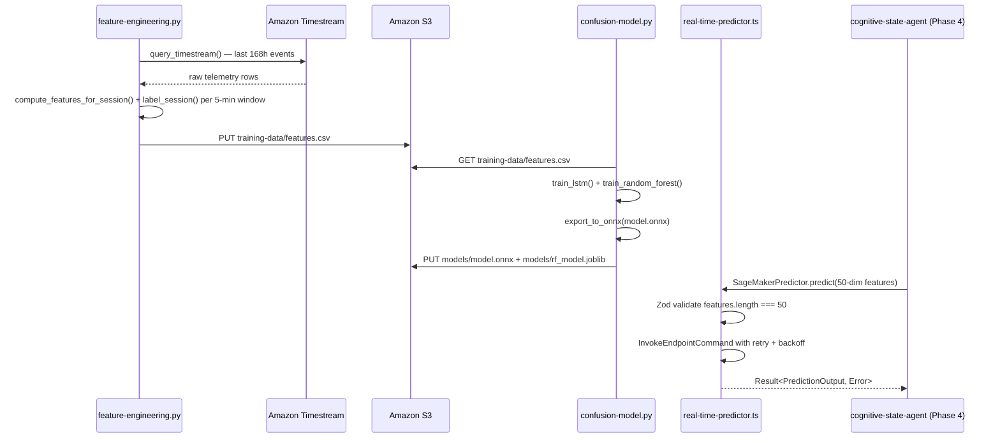

I have created the following plan after thorough exploration and analysis of the codebase. Follow the below plan verbatim. Trust the files and references. Do not re-verify what's written in the plan. Explore only when absolutely necessary. First implement all the proposed file changes and then I'll review all the changes together at the end.

## Observations

The workspace already has `shared/utils/telemetry-helpers.ts` defining `extractFeatures()` producing a 50-dim vector with exactly the 4-window × 12-feature layout plus 2 cross-window features (indices 48, 49). The `CognitiveStateDetector.ts` (Phase 3) has a local `LocalPredictor` stub, and `cognitive-state-agent/index.ts` (Phase 4) has an inline `callSageMaker` helper — both are the integration points that `real-time-predictor.ts` will formalize. The project uses `zod` and the `Result<T,E>` pattern pervasively, and TypeScript targets `ES2020 / commonjs`.

## Approach

Create all six files under `apps/ml-service/` in dependency order: Python requirements and training scripts first (they are standalone), then the TypeScript inference client (which depends on the shared types/utils), then `package.json` + `tsconfig.json` (configuration for the TS client), and finally the `Dockerfile`. This order ensures each file is fully specified before the files that depend on it.

---

## Implementation Steps

### 1. `apps/ml-service/requirements.txt`

Create this file with the exact pinned versions as specified. This must come first because the Dockerfile `COPY`/`pip install` depends on it.

```
torch==2.2.0
torchvision==0.17.0
scikit-learn==1.4.0
pandas==2.2.0
numpy==1.26.3
boto3==1.34.0
botocore==1.34.0
onnx==1.15.0
onnxruntime==1.17.0
joblib==1.3.2
```

---

### 2. `apps/ml-service/training/feature-engineering.py`

Create the file with all imports at the top, then named constants, then all five functions, then the `if __name__ == '__main__': main()` guard.

**Imports and named constants:**
- Import `boto3`, `pandas`, `numpy`, `json`, `os`, `logging`
- Configure structured logging using `logging.basicConfig` with a JSON-style formatter (use `logging.Formatter` with a format string that outputs a JSON object). Acquire a module-level logger via `logger = logging.getLogger(__name__)`
- Declare all named constants as shown in the spec: `TIMESTREAM_DATABASE`, `TIMESTREAM_TABLE`, `S3_OUTPUT_BUCKET`, `S3_OUTPUT_KEY`, `QUERY_WINDOW_HOURS = 168`, `FEATURE_VECTOR_SIZE = 50`, `WINDOWS_MS = [5000, 30000, 120000, 300000]`, `FEATURES_PER_WINDOW = 12`
- Add additional named constants to avoid magic numbers inside functions:
  - `SCROLL_OSC_NORMALIZATION = 5` (mirrors `SCROLL_OSCILLATION_NORMALIZATION` from `telemetry-helpers.ts`)
  - `MIN_SCROLL_EVENTS = 3`
  - `CONFUSION_SCROLL_OSC_THRESHOLD = 0.6`
  - `CONFUSION_UNDO_THRESHOLD = 3`
  - `CONFUSION_TAB_SWITCH_THRESHOLD = 5`
  - `WINDOW_30S_MS = 30000`
  - `SLIDING_WINDOW_MS = 300000` (5-minute window used in `main()`)

**`query_timestream(client: boto3.client, hours: int) -> pd.DataFrame`:**
- Build the QueryString interpolating `TIMESTREAM_DATABASE`, `TIMESTREAM_TABLE`, and the `hours` parameter as `ago(Xh)` (use an f-string: `f'... WHERE time > ago({hours}h) ...'`)
- Call `client.query(QueryString=...)`, iterate with `NextToken` in a `while` loop until the response contains no `NextToken`
- Map each row in `response['Rows']` to a dict extracting `userId`, `sessionId`, `eventType`, `timestamp_ms` (parse Timestream's ISO time string to Unix ms), `payload`
- Return `pd.DataFrame(rows, columns=['userId', 'sessionId', 'eventType', 'timestamp_ms', 'payload'])`

**`calculate_scroll_oscillation(events: pd.DataFrame) -> float`:**
- Filter rows where `eventType == 'scroll'`
- If fewer than `MIN_SCROLL_EVENTS` rows, return `0.0`
- Parse direction from the `payload` JSON string; iterate rows tracking direction changes
- Return `min(1.0, direction_changes / SCROLL_OSC_NORMALIZATION)` — mirrors `calculateScrollOscillation` exactly

**`compute_features_for_session(session_df: pd.DataFrame) -> np.ndarray`:**
- Allocate `features = np.zeros(FEATURE_VECTOR_SIZE, dtype=np.float32)`
- Loop `windowIdx, window_ms` over `enumerate(WINDOWS_MS)`, compute `window_start = max_timestamp_ms - window_ms`, filter `session_df` to that window, set `base = windowIdx * FEATURES_PER_WINDOW`
- For each window set:
  - `features[base+0]` = count of `cursor` events
  - `features[base+1]` = count of `scroll` events
  - `features[base+2]` = count of `keypress` events
  - `features[base+3]` = count of `tab_switch` events
  - `features[base+4]` = `calculate_scroll_oscillation(window_events)`
  - `features[base+5]` = undo count (parse `payload` JSON, sum `isUndo == True`)
  - `features[base+6]` = delete count (sum `isDelete == True`)
  - `features[base+7]` = mean inter-event interval (sort `timestamp_ms`, diff, mean; 0 if fewer than 2 events)
  - `features[base+8]` = std inter-event interval (same; 0 if fewer than 2)
  - `features[base+9]`, `[base+10]`, `[base+11]` = reserved zeros (already 0 from `np.zeros`)
- After the loop: `features[48] = features[0] - features[12]` (cursor activity trend, mirrors `features[48] = features[0] - features[12]` in TS)
- `features[49] = 1.0 if features[4] > 0.5 else 0.0` (high oscillation flag, mirrors TS index 49)
- Return `features`

**`label_session(session_df: pd.DataFrame) -> int`:**
- Use a rolling 30s window. For each 30s slice:
  - Compute `calculate_scroll_oscillation` and undo count
  - If `scroll_osc > CONFUSION_SCROLL_OSC_THRESHOLD` AND `undo_count > CONFUSION_UNDO_THRESHOLD` → return `1`
  - If `tab_switch_count > CONFUSION_TAB_SWITCH_THRESHOLD` → return `1`
- Return `0`

**`main()`:**
- Initialize Timestream client using `boto3.client('timestream-query', region_name=os.environ.get('AWS_REGION', 'us-east-1'))`
- Call `query_timestream(client, QUERY_WINDOW_HOURS)` → raw DataFrame
- Group by `['userId', 'sessionId']`
- For each group, apply sliding 5-minute windows (step through `timestamp_ms` with `SLIDING_WINDOW_MS` size); for each window compute features and label; collect rows
- Assemble into `pd.DataFrame` with 50 feature columns (`f0`…`f49`) + `label` column
- Write to S3: `boto3.client('s3').put_object(Bucket=S3_OUTPUT_BUCKET, Key=S3_OUTPUT_KEY, Body=df.to_csv(index=False).encode())`
- Log class distribution (`df['label'].value_counts()`) and feature means (`df.drop('label', axis=1).mean()`) via `logger.info`

---

### 3. `apps/ml-service/training/confusion-model.py`

**Imports and named constants:**
- Import `torch`, `torch.nn as nn`, `sklearn.ensemble`, `sklearn.model_selection`, `sklearn.metrics`, `numpy`, `pandas`, `boto3`, `onnx`, `onnxruntime`, `os`, `logging`, `json`, `joblib`, `io`
- Declare all named constants as specified. Add: `LSTM_INPUT_SIZE = INPUT_SIZE // SEQUENCE_LENGTH` (= 5) as a derived constant to avoid repeating the division
- Logger: same pattern as feature-engineering.py

**`class LSTMConfusionModel(nn.Module)`:**
- `__init__(self, input_size: int, hidden_size: int, num_layers: int, dropout: float) -> None`:
  - `self.lstm = nn.LSTM(input_size, hidden_size, num_layers, batch_first=True, dropout=dropout)`
  - `self.fc1 = nn.Linear(hidden_size, 64)`
  - `self.relu = nn.ReLU()`
  - `self.dropout = nn.Dropout(dropout)`
  - `self.fc2 = nn.Linear(64, 2)`
- `forward(self, x: torch.Tensor) -> torch.Tensor`:
  - Run `self.lstm(x)` → take `output[:, -1, :]` (last timestep hidden state)
  - Pass through `fc1 → relu → dropout → fc2`
  - Return logits tensor

**`class EnsemblePredictor`:**
- `__init__(self, lstm_model: LSTMConfusionModel, rf_model: sklearn.ensemble.RandomForestClassifier) -> None`
- `predict(self, features: np.ndarray) -> dict`:
  - LSTM path: `torch.tensor` reshape to `(1, SEQUENCE_LENGTH, LSTM_INPUT_SIZE)`, `torch.softmax` on logits, take `[:, 1].item()` as `lstm_prob`
  - RF path: `rf_model.predict_proba(features.reshape(1, -1))[0][1]` as `rf_prob`
  - Ensemble: `final_prob = 0.6 * lstm_prob + 0.4 * rf_prob` (use named constants `LSTM_WEIGHT = 0.6`, `RF_WEIGHT = 0.4`)
  - `state = 'confused' if final_prob > 0.5 else 'focused'`
  - `predicted_time_to_help = max(0.0, (0.5 - final_prob) * 120.0)` (reasonable heuristic; use named constant `TIME_HELP_SCALE = 120.0`)
  - Return `{'state': state, 'confidence': float(final_prob), 'predictedTimeToHelp': predicted_time_to_help}`

**`def load_training_data(s3_client: boto3.client, bucket: str, key: str) -> tuple[np.ndarray, np.ndarray]`:**
- `s3_client.get_object(Bucket=bucket, Key=key)['Body'].read()` → decode to string → `pd.read_csv(io.StringIO(...))`
- Last column is `label`; all others are features
- Return `(df.drop('label', axis=1).values.astype(np.float32), df['label'].values.astype(np.int64))`

**`def train_lstm(X_train: np.ndarray, y_train: np.ndarray) -> LSTMConfusionModel`:**
- Reshape `X_train` to `(n, SEQUENCE_LENGTH, LSTM_INPUT_SIZE)`
- Build `torch.utils.data.TensorDataset` and `DataLoader(dataset, batch_size=BATCH_SIZE, shuffle=True)`
- Instantiate `LSTMConfusionModel(LSTM_INPUT_SIZE, LSTM_HIDDEN_SIZE, LSTM_NUM_LAYERS, LSTM_DROPOUT)`
- Split off `VALIDATION_SPLIT` from training for validation loss tracking; use `sklearn.model_selection.train_test_split`
- Adam optimizer (`lr=LEARNING_RATE`), `nn.CrossEntropyLoss()`
- Loop `NUM_EPOCHS`: forward → loss → `optimizer.zero_grad()` → `loss.backward()` → `optimizer.step()` → log epoch loss
- Track best validation loss, save checkpoint via `torch.save(model.state_dict(), 'best_lstm.pt')` when improved
- At end, reload best checkpoint (`model.load_state_dict(torch.load('best_lstm.pt'))`)
- Return trained model

**`def train_random_forest(X_train: np.ndarray, y_train: np.ndarray) -> sklearn.ensemble.RandomForestClassifier`:**
- `clf = RandomForestClassifier(n_estimators=RF_N_ESTIMATORS, max_depth=RF_MAX_DEPTH, random_state=RANDOM_SEED)`
- `clf.fit(X_train, y_train)`; return `clf`

**`def export_to_onnx(model: LSTMConfusionModel, output_path: str) -> None`:**
- Set `model.eval()`
- Dummy input: `torch.randn(1, SEQUENCE_LENGTH, LSTM_INPUT_SIZE)`
- `torch.onnx.export(model, dummy, output_path, input_names=['input'], output_names=['output'], dynamic_axes={'input': {0: 'batch_size'}, 'output': {0: 'batch_size'}}, opset_version=17)`
- Verify: `ort_session = onnxruntime.InferenceSession(output_path); ort_session.run(None, {'input': dummy.numpy()})` — log success; raise on failure

**`def evaluate_model(ensemble: EnsemblePredictor, X_test: np.ndarray, y_test: np.ndarray) -> dict`:**
- `ACCURACY_THRESHOLD = 0.85`
- Collect predictions by calling `ensemble.predict(row)` for each row in `X_test` (batch with `rf_model.predict_proba` for performance if preferred)
- Compute `accuracy, precision, recall, f1` via `sklearn.metrics`
- Log all four metrics
- `assert accuracy >= ACCURACY_THRESHOLD, f"Accuracy {accuracy:.3f} below threshold {ACCURACY_THRESHOLD}"`
- Return `{'accuracy': accuracy, 'precision': precision, 'recall': recall, 'f1': f1}`

**`def main()`:**
- `torch.manual_seed(RANDOM_SEED)`, `np.random.seed(RANDOM_SEED)`
- `s3 = boto3.client('s3')`, load data via `load_training_data`
- Stratified 80/20 split via `train_test_split(..., stratify=y, test_size=0.2, random_state=RANDOM_SEED)`
- `lstm = train_lstm(X_train, y_train)`; `rf = train_random_forest(X_train, y_train)`
- `ensemble = EnsemblePredictor(lstm, rf)`; `evaluate_model(ensemble, X_test, y_test)`
- `export_to_onnx(lstm, 'model.onnx')`; `joblib.dump(rf, 'rf_model.joblib')`
- Upload both files to S3: `s3.upload_file('model.onnx', S3_MODEL_BUCKET, 'models/model.onnx')` and `s3.upload_file('rf_model.joblib', S3_MODEL_BUCKET, 'models/rf_model.joblib')`

---

### 4. `apps/ml-service/inference/real-time-predictor.ts`

**Imports:**
- `import { SageMakerRuntimeClient, InvokeEndpointCommand } from '@aws-sdk/client-sagemaker-runtime'`
- `import { z } from 'zod'`
- `import type { Result } from '@cognitive-compass/shared/types'`

**Named constants (module-level `const`):**
```
const SAGEMAKER_ENDPOINT_NAME = process.env['SAGEMAKER_ENDPOINT_NAME'] ?? ''
const CONTENT_TYPE = 'application/json'
const ACCEPT_TYPE = 'application/json'
const MAX_RETRY_ATTEMPTS = 3
const BASE_RETRY_DELAY_MS = 500
const BACKOFF_MULTIPLIER = 2
const FEATURE_VECTOR_LENGTH = 50
const SCROLL_OSC_INDEX = 4
const UNDO_INDEX = 5
const CONFUSION_THRESHOLD = 0.7
```

**Interfaces** — define exactly as specified in the task. Note that `PredictionOutput.state` must include `'focused' | 'exploring' | 'confused' | 'stuck'` to match `CognitiveStateState` from `shared/types`.

**Zod schemas** (module-level, for reuse in both validators):
- `PredictionInputSchema = z.object({ features: z.array(z.number().finite()).length(FEATURE_VECTOR_LENGTH) })`
- `PredictionOutputSchema = z.object({ state: z.enum(['focused', 'exploring', 'confused', 'stuck']), confidence: z.number().min(0).max(1), predictedTimeToHelp: z.number() })`

**`SageMakerPredictor` class:**
- Constructor: `this.client = new SageMakerRuntimeClient({ region: process.env['AWS_REGION'] ?? 'us-east-1' })`
- `predict(features: number[]): Promise<Result<PredictionOutput, Error>>`:
  - Validate with `PredictionInputSchema.safeParse({ features })`; return `{ success: false, error }` on failure
  - Serialize: `const body = new TextEncoder().encode(JSON.stringify({ features }))`
  - Retry loop (up to `MAX_RETRY_ATTEMPTS`) with exponential backoff (`BASE_RETRY_DELAY_MS * BACKOFF_MULTIPLIER ** attempt`):
    - `const cmd = new InvokeEndpointCommand({ EndpointName: SAGEMAKER_ENDPOINT_NAME, ContentType: CONTENT_TYPE, Accept: ACCEPT_TYPE, Body: body })`
    - Send via `this.client.send(cmd)`
    - On `ServiceUnavailableException` or network error (check `error.name`): wait backoff delay and retry; on other errors: break and return failure
  - Decode `response.Body` with `new TextDecoder().decode(...)`; `JSON.parse`; validate with `PredictionOutputSchema.safeParse`
  - Return `{ success: true, data: output }` or `{ success: false, error: new Error('...') }`

**`LocalPredictor` class:**
- `predict(features: number[]): Promise<Result<PredictionOutput, Error>>`:
  - No external calls; pure heuristic using `features[SCROLL_OSC_INDEX]` and `features[UNDO_INDEX]`
  - If confused: `return Promise.resolve({ success: true, data: { state: 'confused', confidence: features[SCROLL_OSC_INDEX], predictedTimeToHelp: 15 } })`
  - Otherwise: `return Promise.resolve({ success: true, data: { state: 'focused', confidence: 1 - features[SCROLL_OSC_INDEX], predictedTimeToHelp: 60 } })`

**Exports:**
```typescript
export { SageMakerPredictor, LocalPredictor, type RealTimePredictor, type PredictionOutput }
```

---

### 5. `apps/ml-service/package.json`

Create exactly as specified in the task. Use `"latest"` for `@aws-sdk/client-sagemaker-runtime` and `zod` as specified. The `@cognitive-compass/shared` workspace reference is already the pattern used in `api-service`.

---

### 6. `apps/ml-service/tsconfig.json`

Create with the following, matching the pattern in `shared/tsconfig.json` and `api-service/tsconfig.json`:
- `"target": "ES2020"`, `"module": "commonjs"`
- Full strict suite: `strict`, `noImplicitAny`, `strictNullChecks`, `strictFunctionTypes`, `noUnusedLocals`, `noUnusedParameters`, `noImplicitReturns`
- `"outDir": "./dist"`, `"rootDir": "."`
- `"include": ["inference/**/*.ts"]`
- `"paths": { "@cognitive-compass/shared/*": ["../../shared/*"] }`
- `"esModuleInterop": true`, `"skipLibCheck": true`, `"forceConsistentCasingInFileNames": true`

---

### 7. `apps/ml-service/Dockerfile`

Layer ordering is critical for Docker cache efficiency — requirements before code:

```
Stage order:
1. FROM (AWS DLC base)
2. LABEL metadata
3. ENV variables (SAGEMAKER_PROGRAM, SAGEMAKER_SUBMIT_DIRECTORY, PYTHONUNBUFFERED, PYTHONDONTWRITEBYTECODE)
4. RUN useradd -m -u 1000 sagemaker && mkdir -p /opt/ml && chown -R sagemaker:sagemaker /opt/ml
5. WORKDIR /opt/ml/code
6. COPY requirements.txt .
7. RUN pip install --no-cache-dir -r requirements.txt
8. COPY training/ .
9. USER sagemaker
10. HEALTHCHECK NONE
11. ENTRYPOINT ["python3"]
12. CMD ["confusion-model.py"]
```

- `LABEL version="0.1.0" description="Cognitive Compass confusion detection training container"`
- Non-root user must be created **before** `WORKDIR` and `COPY` so `chown` applies; switch to `USER sagemaker` **after** all `COPY`/`RUN` instructions (pip install must run as root)

---

## Data & Control Flow



---

## Key Alignment Notes

| Concern | How addressed |
|---|---|
| `extractFeatures()` parity | `compute_features_for_session()` mirrors the exact index layout: `base+0..3` event counts, `+4` scroll oscillation, `+5` undo, `+6` delete, `+7` mean IEI, `+8` std IEI, `+9..11` reserved zeros, `features[48]` cross-window trend, `features[49]` oscillation flag |
| `Result<T,E>` pattern | `real-time-predictor.ts` imports `Result` from `@cognitive-compass/shared/types` which already exports it as `type Result<T, E = Error>` |
| No `any` in TypeScript | All types explicit; Zod schemas validate all external data boundaries |
| SageMaker endpoint reuse | `cognitive-state-agent/index.ts` already imports `SageMakerRuntimeClient` — `SageMakerPredictor` encapsulates this with retry logic and Zod validation that the agent's inline `callSageMaker` lacks |
| LSTM sequence shape | 50 features / 10 timesteps = 5 features/timestep (`LSTM_INPUT_SIZE = INPUT_SIZE // SEQUENCE_LENGTH`); ONNX export uses this same shape |